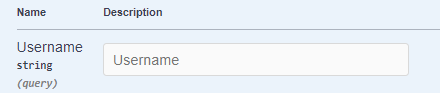

## Add Education
**Post** 
`/Education/AddEducation`

**Request**
The Request is **multipart/form-data**


**Response**
The Response is **application/json**


**For example**

***First Example***

*If Request is*


*The Response is*


***Second Example -- Wrong username***

*If Request is*


*The Response is*


## Get Educations
**Get** 
`/Education/GetEducations`

**Request**
The Request is **Query Params**



**Response**
The Response is **application/json**
```
[
  {
    "id": 0,
    "school": "string",
    "degree": "string",
    "fieldOfStudy": "string",
    "startDate": "string",
    "endDate": "string",
    "grade": "string",
    "description": "string",
    "userId": "string",
    "user": {
      "id": "string",
      "userName": "string",
      "normalizedUserName": "string",
      "email": "string",
      "normalizedEmail": "string",
      "emailConfirmed": true,
      "passwordHash": "string",
      "securityStamp": "string",
      "concurrencyStamp": "string",
      "phoneNumber": "string",
      "phoneNumberConfirmed": true,
      "twoFactorEnabled": true,
      "lockoutEnd": "2024-08-19T08:43:31.052Z",
      "lockoutEnabled": true,
      "accessFailedCount": 0,
      "firstName": "string",
      "lastName": "string",
      "pictureURL": "string",
      "educations": [
        "string"
      ]
    }
  }
]
```

**For example**

***First Example***

*If Request is*


*The Response is*

```
[
  {
    "id": 3004,
    "school": "DIT",
    "degree": null,
    "fieldOfStudy": null,
    "startDate": null,
    "endDate": null,
    "grade": null,
    "description": null,
    "userId": "f3261fee-36c8-4034-a16d-c796f491a9c5",
    "user": {
      "firstName": "Dimitris",
      "lastName": "Rammos",
      "pictureURL": "rammos.com",
      "educations": [
        null,
        {
          "id": 3005,
          "school": "MIT comptuter",
          "degree": null,
          "fieldOfStudy": null,
          "startDate": "19/8/2019",
          "endDate": "19/8/2024",
          "grade": "9.5",
          "description": "My desc",
          "userId": "f3261fee-36c8-4034-a16d-c796f491a9c5",
          "user": null
        }
      ],
      "id": "f3261fee-36c8-4034-a16d-c796f491a9c5",
      "userName": "jrammos",
      "normalizedUserName": "JRAMMOS",
      "email": "jrammos@outlook.com.gr",
      "normalizedEmail": "JRAMMOS@OUTLOOK.COM.GR",
      "emailConfirmed": false,
      "passwordHash": "AQAAAAIAAYagAAAAENSu1TceuHc/WaKFwzIcVZGS4/A2gCWJWp/T91d8D2553SCDxlk1oFhCB4T+NmQvZw==",
      "securityStamp": "GELZKA5H5YLSBNP5Z3744D2DCQBAWALE",
      "concurrencyStamp": "89f11a15-2ed3-41ae-98ed-faf85e78e929",
      "phoneNumber": "1234567890",
      "phoneNumberConfirmed": false,
      "twoFactorEnabled": false,
      "lockoutEnd": null,
      "lockoutEnabled": true,
      "accessFailedCount": 0
    }
  },
  {
    "id": 3005,
    "school": "MIT comptuter",
    "degree": null,
    "fieldOfStudy": null,
    "startDate": "19/8/2019",
    "endDate": "19/8/2024",
    "grade": "9.5",
    "description": "My desc",
    "userId": "f3261fee-36c8-4034-a16d-c796f491a9c5",
    "user": {
      "firstName": "Dimitris",
      "lastName": "Rammos",
      "pictureURL": "rammos.com",
      "educations": [
        {
          "id": 3004,
          "school": "DIT",
          "degree": null,
          "fieldOfStudy": null,
          "startDate": null,
          "endDate": null,
          "grade": null,
          "description": null,
          "userId": "f3261fee-36c8-4034-a16d-c796f491a9c5",
          "user": null
        },
        null
      ],
      "id": "f3261fee-36c8-4034-a16d-c796f491a9c5",
      "userName": "jrammos",
      "normalizedUserName": "JRAMMOS",
      "email": "jrammos@outlook.com.gr",
      "normalizedEmail": "JRAMMOS@OUTLOOK.COM.GR",
      "emailConfirmed": false,
      "passwordHash": "AQAAAAIAAYagAAAAENSu1TceuHc/WaKFwzIcVZGS4/A2gCWJWp/T91d8D2553SCDxlk1oFhCB4T+NmQvZw==",
      "securityStamp": "GELZKA5H5YLSBNP5Z3744D2DCQBAWALE",
      "concurrencyStamp": "89f11a15-2ed3-41ae-98ed-faf85e78e929",
      "phoneNumber": "1234567890",
      "phoneNumberConfirmed": false,
      "twoFactorEnabled": false,
      "lockoutEnd": null,
      "lockoutEnabled": true,
      "accessFailedCount": 0
    }
  }
]
```

***Second Example -- Wrong username***

*If Request is*


*The Response is*


## Edit Education
**Put** 
`/Education/EditEducation`


**Request**
The Request is **multipart/form-data**


**Response**
The Response is **application/json**
```
{
  "id": 0,
  "school": "string",
  "degree": "string",
  "fieldOfStudy": "string",
  "startDate": "string",
  "endDate": "string",
  "grade": "string",
  "description": "string",
  "userId": "string",
  "user": {
    "id": "string",
    "userName": "string",
    "normalizedUserName": "string",
    "email": "string",
    "normalizedEmail": "string",
    "emailConfirmed": true,
    "passwordHash": "string",
    "securityStamp": "string",
    "concurrencyStamp": "string",
    "phoneNumber": "string",
    "phoneNumberConfirmed": true,
    "twoFactorEnabled": true,
    "lockoutEnd": "2024-08-21T08:46:31.195Z",
    "lockoutEnabled": true,
    "accessFailedCount": 0,
    "firstName": "string",
    "lastName": "string",
    "pictureURL": "string",
    "educations": [
      "string"
    ],
    "experiences": [
      {
        "id": 0,
        "title": "string",
        "employmentType": "string",
        "companyName": "string",
        "location": "string",
        "locationType": "string",
        "startDate": "2024-08-21T08:46:31.195Z",
        "endDate": "2024-08-21T08:46:31.195Z",
        "currentJob": true,
        "description": "string",
        "userId": "string",
        "user": "string"
      }
    ]
  }
}
```


## Delete Education
**Delete** 
`/Users/DeleteEducation`


**Request**
The Request is **multipart/form-data**


**Response**
The Response is **application/json**


