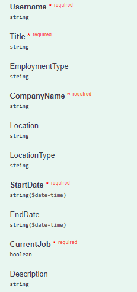
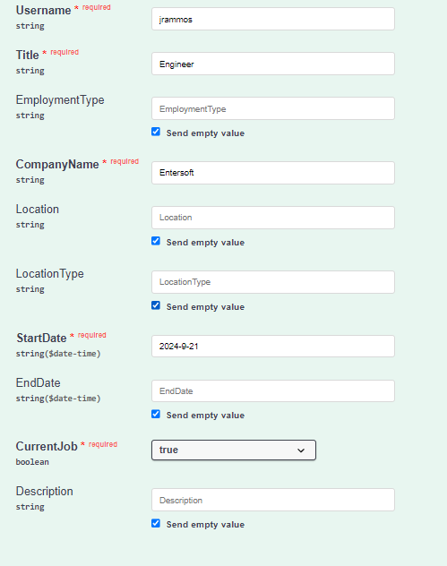
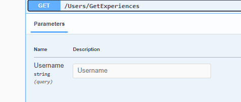
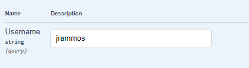
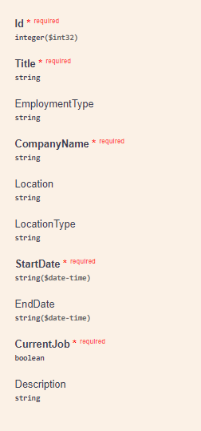
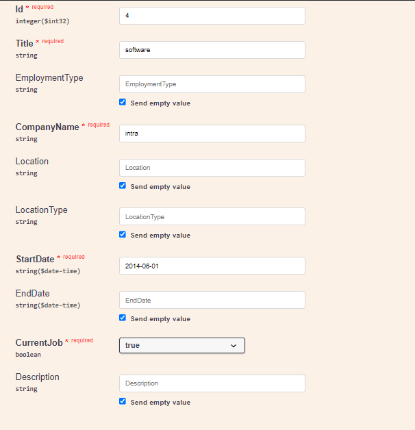
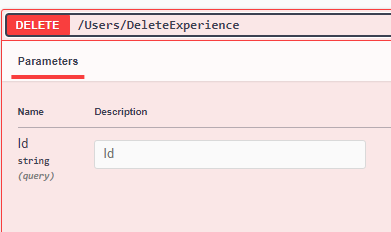
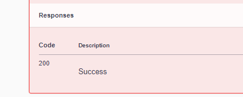
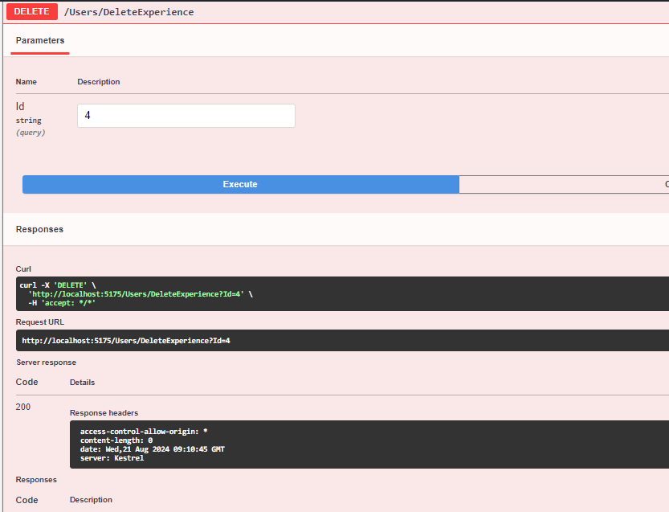

## Add Experience
**Post** 
`/Experience/AddExperience`

**Request**
The Request is **multipart/form-data**



**Response**
The Response is **application/json**
```
{
  "id": 0,
  "title": "string",
  "employmentType": "string",
  "companyName": "string",
  "location": "string",
  "locationType": "string",
  "startDate": "2024-08-21T08:41:54.527Z",
  "endDate": "2024-08-21T08:41:54.527Z",
  "currentJob": true,
  "description": "string",
  "userId": "string",
  "user": {
    "id": "string",
    "userName": "string",
    "normalizedUserName": "string",
    "email": "string",
    "normalizedEmail": "string",
    "emailConfirmed": true,
    "passwordHash": "string",
    "securityStamp": "string",
    "concurrencyStamp": "string",
    "phoneNumber": "string",
    "phoneNumberConfirmed": true,
    "twoFactorEnabled": true,
    "lockoutEnd": "2024-08-21T08:41:54.527Z",
    "lockoutEnabled": true,
    "accessFailedCount": 0,
    "firstName": "string",
    "lastName": "string",
    "pictureURL": "string",
    "educations": [
      {
        "id": 0,
        "school": "string",
        "degree": "string",
        "fieldOfStudy": "string",
        "startDate": "string",
        "endDate": "string",
        "grade": "string",
        "description": "string",
        "userId": "string",
        "user": "string"
      }
    ],
    "experiences": [
      "string"
    ]
  }
}
```

**For example**

***First Example***

*If Request is*



*The Response is*

```
{
  "id": 2,
  "title": "Engineer",
  "employmentType": null,
  "companyName": "Entersoft",
  "location": null,
  "locationType": null,
  "startDate": "2024-09-21T00:00:00",
  "endDate": null,
  "currentJob": true,
  "description": null,
  "userId": "7a29e650-b614-483c-85d1-4f7473a890b0",
  "user": {
    "firstName": "Dimitris",
    "lastName": "Rammos",
    "pictureURL": "rammos.com",
    "educations": [],
    "experiences": [
      null
    ],
    "id": "7a29e650-b614-483c-85d1-4f7473a890b0",
    "userName": "jrammos",
    "normalizedUserName": "JRAMMOS",
    "email": "jrammos@outlook.com.gr",
    "normalizedEmail": "JRAMMOS@OUTLOOK.COM.GR",
    "emailConfirmed": false,
    "passwordHash": "AQAAAAIAAYagAAAAEGm3K4+tQbfQmB2lct5xIpZsvLywueNuNUY+pqUbI5sTzgex7xOjDBxMMM50acjc+w==",
    "securityStamp": "UQLSWPBA7CU3IC4FKMKGONI2J77MUYCE",
    "concurrencyStamp": "ec5ea5ca-6c6e-438e-a3a8-80b2b3043acd",
    "phoneNumber": "1234567890",
    "phoneNumberConfirmed": false,
    "twoFactorEnabled": false,
    "lockoutEnd": null,
    "lockoutEnabled": true,
    "accessFailedCount": 0
  }
}
Response headers
```


## Get Educations
**Get** 
`/Experience/GetEducations`

**Request**
The Request is **Query Params**



**Response**
The Response is **application/json**
```
[
  {
    "id": 0,
    "title": "string",
    "employmentType": "string",
    "companyName": "string",
    "location": "string",
    "locationType": "string",
    "startDate": "2024-08-21T08:11:19.793Z",
    "endDate": "2024-08-21T08:11:19.793Z",
    "currentJob": true,
    "description": "string",
    "userId": "string",
    "user": {
      "id": "string",
      "userName": "string",
      "normalizedUserName": "string",
      "email": "string",
      "normalizedEmail": "string",
      "emailConfirmed": true,
      "passwordHash": "string",
      "securityStamp": "string",
      "concurrencyStamp": "string",
      "phoneNumber": "string",
      "phoneNumberConfirmed": true,
      "twoFactorEnabled": true,
      "lockoutEnd": "2024-08-21T08:11:19.793Z",
      "lockoutEnabled": true,
      "accessFailedCount": 0,
      "firstName": "string",
      "lastName": "string",
      "pictureURL": "string",
      "educations": [
        {
          "id": 0,
          "school": "string",
          "degree": "string",
          "fieldOfStudy": "string",
          "startDate": "string",
          "endDate": "string",
          "grade": "string",
          "description": "string",
          "userId": "string",
          "user": "string"
        }
      ],
      "experiences": [
        "string"
      ]
    }
  }
]
```

**For example**

***First Example***

*If Request is*



*The Response is*

```
[
  {
    "id": 1,
    "title": "Engineer",
    "employmentType": null,
    "companyName": "Entersoft",
    "location": null,
    "locationType": null,
    "startDate": "2024-08-19T00:00:00",
    "endDate": null,
    "currentJob": true,
    "description": null,
    "userId": "15edb691-aa6e-41e1-869f-8614c620b411",
    "user": {
      "firstName": "Dimitris",
      "lastName": "Rammos",
      "pictureURL": "rammos.com",
      "educations": [],
      "experiences": [
        null
      ],
      "id": "15edb691-aa6e-41e1-869f-8614c620b411",
      "userName": "jrammos",
      "normalizedUserName": "JRAMMOS",
      "email": "jrammos@outlook.com.gr",
      "normalizedEmail": "JRAMMOS@OUTLOOK.COM.GR",
      "emailConfirmed": false,
      "passwordHash": "AQAAAAIAAYagAAAAEGsaDf+161n39GJclPeYg6TdJBXmJIdj4yAPzmWl+4NaYRcR4LZ1zKzZ4SLMxm+ujQ==",
      "securityStamp": "CZWDHAFSTRZO5XWVAY47AQS5IVNOYUEP",
      "concurrencyStamp": "61df35c3-09a0-4c45-ae7a-9bcf3fdd098e",
      "phoneNumber": "1234567890",
      "phoneNumberConfirmed": false,
      "twoFactorEnabled": false,
      "lockoutEnd": null,
      "lockoutEnabled": true,
      "accessFailedCount": 0
    }
  }
]
```


## Edit Experience
**Put** 
`/Experience/EditExperience`


**Request**
The Request is **multipart/form-data**




**Response**
The Response is **application/json**
```
{
  "id": 0,
  "title": "string",
  "employmentType": "string",
  "companyName": "string",
  "location": "string",
  "locationType": "string",
  "startDate": "2024-08-21T08:48:13.110Z",
  "endDate": "2024-08-21T08:48:13.111Z",
  "currentJob": true,
  "description": "string",
  "userId": "string",
  "user": {
    "id": "string",
    "userName": "string",
    "normalizedUserName": "string",
    "email": "string",
    "normalizedEmail": "string",
    "emailConfirmed": true,
    "passwordHash": "string",
    "securityStamp": "string",
    "concurrencyStamp": "string",
    "phoneNumber": "string",
    "phoneNumberConfirmed": true,
    "twoFactorEnabled": true,
    "lockoutEnd": "2024-08-21T08:48:13.111Z",
    "lockoutEnabled": true,
    "accessFailedCount": 0,
    "firstName": "string",
    "lastName": "string",
    "pictureURL": "string",
    "educations": [
      {
        "id": 0,
        "school": "string",
        "degree": "string",
        "fieldOfStudy": "string",
        "startDate": "string",
        "endDate": "string",
        "grade": "string",
        "description": "string",
        "userId": "string",
        "user": "string"
      }
    ],
    "experiences": [
      "string"
    ]
  }
}
```

**For example**

***First Example***

*If Request is*



*The Response is*

```
{
  "id": 4,
  "title": "software",
  "employmentType": null,
  "companyName": "intra",
  "location": null,
  "locationType": null,
  "startDate": "2014-06-01T00:00:00",
  "endDate": null,
  "currentJob": true,
  "description": null,
  "userId": "4ab32081-319f-4705-b133-6a4bb3a04432",
  "user": null
}
```

## Delete Experience
**Delete** 
`/Experience/DeleteExperience`


**Request**
The Request is **multipart/form-data**



**Response**
The Response is **application/json**



**For example**

*If Request and Response is*


