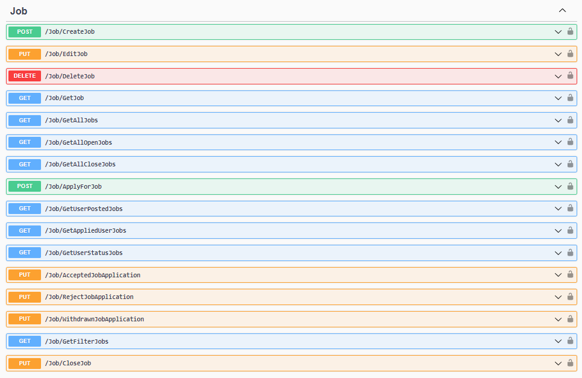

# Job Controller

Set the Url from Api:
For example the BackEnd Api url is: http://localhost:5175



## CreateJob
**Post**
`/Job/CreateJob`

**Request**
The Request is **multipart/form-data**


**Response**
The Response is **applicatio/json -- boolean**

```
```

## EditJob
**Put**
`/Job/EditJob`

**Request**
The Request is **multipart/form-data**


**Response**
The Response is **applicatio/json -- boolean**

```
```

## DeletePost
**Delete**
`/Job/DeleteJob`

**Request**
The Request is **multipart/form-data**


**Response**
The Response is **applicatio/json -- boolean**

```
```

## GetJob
**Get**
`/Job/GetJob`

**Request**
The Request is **multipart/form-data**


**Response**
The Response is **applicatio/json -- boolean**

```
```

## GetAllJobs
**Get**
`/Job/GetAllJobs`

**Request**
The Request is **multipart/form-data**


**Response**
The Response is **applicatio/json -- boolean**

```
```

## GetAllOpenJobs
**Get**
`/Job/GetAllOpenJobs`

**Request**
The Request is **multipart/form-data**


**Response**
The Response is **applicatio/json -- boolean**

```
```

## GetAllCloseJobs
**Get**
`/Job/GetAllCloseJobs`

**Request**
The Request is **multipart/form-data**


**Response**
The Response is **applicatio/json -- boolean**

```
```

## ApplyForJob
**Post**
`/Job/ApplyForJob`

**Request**
The Request is **multipart/form-data**


**Response**
The Response is **applicatio/json -- boolean**

```
```

## GetUserPostedJobs
**Get**
`/Job/GetUserPostedJobs`

**Request**
The Request is **multipart/form-data**


**Response**
The Response is **applicatio/json -- boolean**

```
```

## GetAppliedUserJobs
**Get**
`/Job/GetAppliedUserJobs`

**Request**
The Request is **multipart/form-data**


**Response**
The Response is **applicatio/json -- boolean**

```
```

## GetUserStatusJobs
**Get**
`/Job/GetUserStatusJobs`

**Request**
The Request is **multipart/form-data**


**Response**
The Response is **applicatio/json -- boolean**

```
```

## AcceptedJobApplication
**Put**
`/Job/AcceptedJobApplication`

**Request**
The Request is **multipart/form-data**


**Response**
The Response is **applicatio/json -- boolean**

```
```

## RejectJobApplication
**Put**
`/Job/AcceptedJobApplication`

**Request**
The Request is **multipart/form-data**


**Response**
The Response is **applicatio/json -- boolean**

```
```

## WithdrawnJobApplication
**Put**
`/Job/WithdrawnJobApplication`

**Request**
The Request is **multipart/form-data**


**Response**
The Response is **applicatio/json -- boolean**

```
```


## GetFilteredJobs
**Get**
`/Job/GetFilteredJobs`

**Request**
The Request is **multipart/form-data**


**Response**
The Response is **applicatio/json -- boolean**

```
```


## CloseJob
**Put**
`/Job/CloseJob`

**Request**
The Request is **multipart/form-data**


**Response**
The Response is **applicatio/json -- boolean**

```
```

