# Job Controller

Set the Url from Api:
For example the BackEnd Api url is: http://localhost:5175


## CreateJob
**Post**
`/Job/CreateJob`

**Request**
The Request is **multipart/form-data**

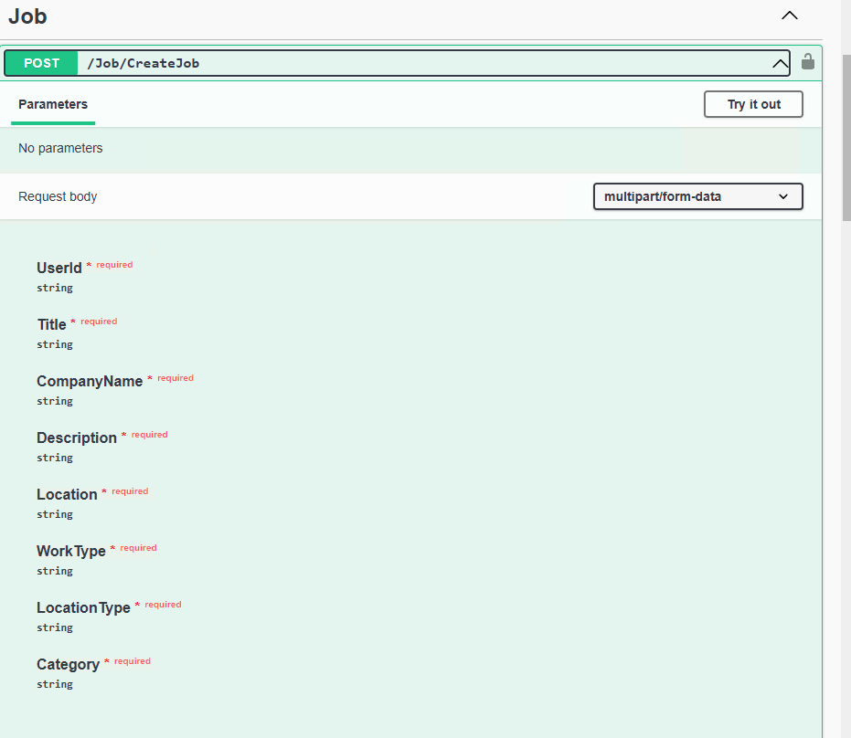

**Response**
The Response is **applicatio/json -- boolean**

```
{
  "id": 0,
  "title": "string",
  "companyName": "string",
  "description": "string",
  "location": "string",
  "workType": "string",
  "locationType": "string",
  "category": "string",
  "postedDate": "2024-09-09T19:43:44.386Z",
  "isActive": true,
  "closingDate": "2024-09-09T19:43:44.386Z",
  "userId": "string",
  "user": {
    "id": "string",
    "userName": "string",
    "normalizedUserName": "string",
    "email": "string",
    "normalizedEmail": "string",
    "emailConfirmed": true,
    "passwordHash": "string",
    "securityStamp": "string",
    "concurrencyStamp": "string",
    "phoneNumber": "string",
    "phoneNumberConfirmed": true,
    "twoFactorEnabled": true,
    "lockoutEnd": "2024-09-09T19:43:44.386Z",
    "lockoutEnabled": true,
    "accessFailedCount": 0,
    "firstName": "string",
    "lastName": "string",
    "birthday": "string",
    "pictureURL": "string",
    "educations": [
      {
        "id": 0,
        "school": "string",
        "degree": "string",
        "fieldOfStudy": "string",
        "startDate": "string",
        "endDate": "string",
        "grade": "string",
        "description": "string",
        "userId": "string",
        "user": "string"
      }
    ],
    "experiences": [
      {
        "id": 0,
        "title": "string",
        "employmentType": "string",
        "companyName": "string",
        "location": "string",
        "locationType": "string",
        "startDate": "2024-09-09T19:43:44.386Z",
        "endDate": "2024-09-09T19:43:44.386Z",
        "currentJob": true,
        "description": "string",
        "userId": "string",
        "user": "string"
      }
    ],
    "posts": [
      {
        "id": 0,
        "title": "string",
        "content": "string",
        "createdAt": "2024-09-09T19:43:44.386Z",
        "updateAt": "2024-09-09T19:43:44.386Z",
        "pictureUrls": [
          "string"
        ],
        "videoUrls": [
          "string"
        ],
        "reactionsCount": 0,
        "commentsCount": 0,
        "comments": [
          {
            "id": 0,
            "content": "string",
            "createdAt": "2024-09-09T19:43:44.386Z",
            "postId": 0,
            "post": "string",
            "username": "string"
          }
        ],
        "reactions": [
          {
            "id": 0,
            "reactionType": "string",
            "postId": 0,
            "post": "string",
            "username": "string"
          }
        ],
        "isLikedByCurrentUser": true,
        "userId": "string",
        "user": "string"
      }
    ],
    "connectedUsers": [
      "string"
    ],
    "pendingRequestUsers": [
      "string"
    ],
    "inComingRequestUsers": [
      "string"
    ],
    "postedJobs": [
      "string"
    ]
  },
  "jobApplications": [
    {
      "id": 0,
      "jobId": 0,
      "job": "string",
      "username": "string",
      "appliedDate": "2024-09-09T19:43:44.386Z",
      "coverLetter": "string",
      "status": 0
    }
  ]
}
```

## EditJob
**Put**
`/Job/EditJob`

**Request**
The Request is **multipart/form-data**

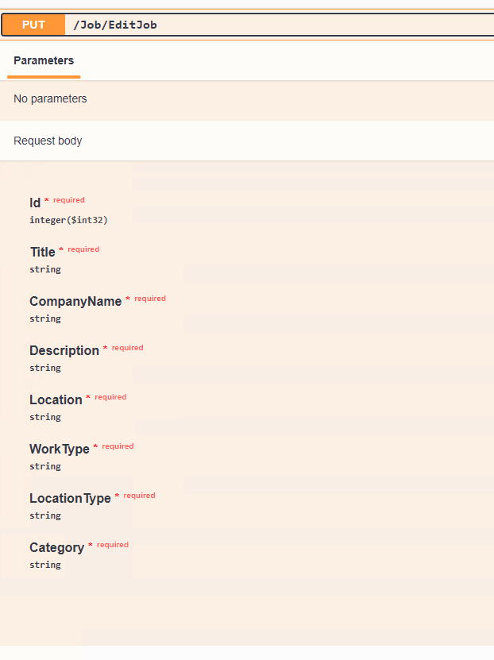

**Response**
The Response is **applicatio/json -- boolean**

```
{
  "id": 0,
  "title": "string",
  "companyName": "string",
  "description": "string",
  "location": "string",
  "workType": "string",
  "locationType": "string",
  "category": "string",
  "postedDate": "2024-09-09T19:46:03.695Z",
  "isActive": true,
  "closingDate": "2024-09-09T19:46:03.695Z",
  "userId": "string",
  "user": {
    "id": "string",
    "userName": "string",
    "normalizedUserName": "string",
    "email": "string",
    "normalizedEmail": "string",
    "emailConfirmed": true,
    "passwordHash": "string",
    "securityStamp": "string",
    "concurrencyStamp": "string",
    "phoneNumber": "string",
    "phoneNumberConfirmed": true,
    "twoFactorEnabled": true,
    "lockoutEnd": "2024-09-09T19:46:03.695Z",
    "lockoutEnabled": true,
    "accessFailedCount": 0,
    "firstName": "string",
    "lastName": "string",
    "birthday": "string",
    "pictureURL": "string",
    "educations": [
      {
        "id": 0,
        "school": "string",
        "degree": "string",
        "fieldOfStudy": "string",
        "startDate": "string",
        "endDate": "string",
        "grade": "string",
        "description": "string",
        "userId": "string",
        "user": "string"
      }
    ],
    "experiences": [
      {
        "id": 0,
        "title": "string",
        "employmentType": "string",
        "companyName": "string",
        "location": "string",
        "locationType": "string",
        "startDate": "2024-09-09T19:46:03.695Z",
        "endDate": "2024-09-09T19:46:03.695Z",
        "currentJob": true,
        "description": "string",
        "userId": "string",
        "user": "string"
      }
    ],
    "posts": [
      {
        "id": 0,
        "title": "string",
        "content": "string",
        "createdAt": "2024-09-09T19:46:03.695Z",
        "updateAt": "2024-09-09T19:46:03.695Z",
        "pictureUrls": [
          "string"
        ],
        "videoUrls": [
          "string"
        ],
        "reactionsCount": 0,
        "commentsCount": 0,
        "comments": [
          {
            "id": 0,
            "content": "string",
            "createdAt": "2024-09-09T19:46:03.695Z",
            "postId": 0,
            "post": "string",
            "username": "string"
          }
        ],
        "reactions": [
          {
            "id": 0,
            "reactionType": "string",
            "postId": 0,
            "post": "string",
            "username": "string"
          }
        ],
        "isLikedByCurrentUser": true,
        "userId": "string",
        "user": "string"
      }
    ],
    "connectedUsers": [
      "string"
    ],
    "pendingRequestUsers": [
      "string"
    ],
    "inComingRequestUsers": [
      "string"
    ],
    "postedJobs": [
      "string"
    ]
  },
  "jobApplications": [
    {
      "id": 0,
      "jobId": 0,
      "job": "string",
      "username": "string",
      "appliedDate": "2024-09-09T19:46:03.695Z",
      "coverLetter": "string",
      "status": 0
    }
  ]
}
```

## DeletePost
**Delete**
`/Job/DeleteJob`

**Request**
The Request is **multipart/form-data**

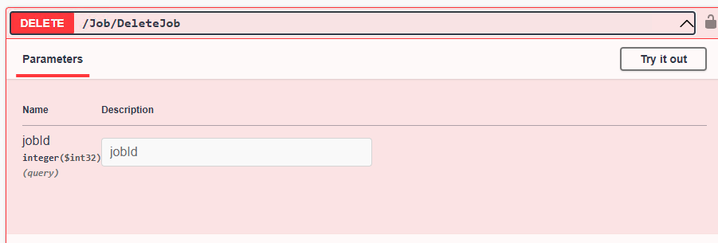


**Response**
The Response is **applicatio/json -- boolean**

```
{
  "id": 0,
  "title": "string",
  "companyName": "string",
  "description": "string",
  "location": "string",
  "workType": "string",
  "locationType": "string",
  "category": "string",
  "postedDate": "2024-09-09T19:46:53.146Z",
  "isActive": true,
  "closingDate": "2024-09-09T19:46:53.146Z",
  "userId": "string",
  "user": {
    "id": "string",
    "userName": "string",
    "normalizedUserName": "string",
    "email": "string",
    "normalizedEmail": "string",
    "emailConfirmed": true,
    "passwordHash": "string",
    "securityStamp": "string",
    "concurrencyStamp": "string",
    "phoneNumber": "string",
    "phoneNumberConfirmed": true,
    "twoFactorEnabled": true,
    "lockoutEnd": "2024-09-09T19:46:53.146Z",
    "lockoutEnabled": true,
    "accessFailedCount": 0,
    "firstName": "string",
    "lastName": "string",
    "birthday": "string",
    "pictureURL": "string",
    "educations": [
      {
        "id": 0,
        "school": "string",
        "degree": "string",
        "fieldOfStudy": "string",
        "startDate": "string",
        "endDate": "string",
        "grade": "string",
        "description": "string",
        "userId": "string",
        "user": "string"
      }
    ],
    "experiences": [
      {
        "id": 0,
        "title": "string",
        "employmentType": "string",
        "companyName": "string",
        "location": "string",
        "locationType": "string",
        "startDate": "2024-09-09T19:46:53.146Z",
        "endDate": "2024-09-09T19:46:53.146Z",
        "currentJob": true,
        "description": "string",
        "userId": "string",
        "user": "string"
      }
    ],
    "posts": [
      {
        "id": 0,
        "title": "string",
        "content": "string",
        "createdAt": "2024-09-09T19:46:53.146Z",
        "updateAt": "2024-09-09T19:46:53.146Z",
        "pictureUrls": [
          "string"
        ],
        "videoUrls": [
          "string"
        ],
        "reactionsCount": 0,
        "commentsCount": 0,
        "comments": [
          {
            "id": 0,
            "content": "string",
            "createdAt": "2024-09-09T19:46:53.146Z",
            "postId": 0,
            "post": "string",
            "username": "string"
          }
        ],
        "reactions": [
          {
            "id": 0,
            "reactionType": "string",
            "postId": 0,
            "post": "string",
            "username": "string"
          }
        ],
        "isLikedByCurrentUser": true,
        "userId": "string",
        "user": "string"
      }
    ],
    "connectedUsers": [
      "string"
    ],
    "pendingRequestUsers": [
      "string"
    ],
    "inComingRequestUsers": [
      "string"
    ],
    "postedJobs": [
      "string"
    ]
  },
  "jobApplications": [
    {
      "id": 0,
      "jobId": 0,
      "job": "string",
      "username": "string",
      "appliedDate": "2024-09-09T19:46:53.146Z",
      "coverLetter": "string",
      "status": 0
    }
  ]
}
```

## GetJob
**Get**
`/Job/GetJob`

**Request**
The Request is **multipart/form-data**

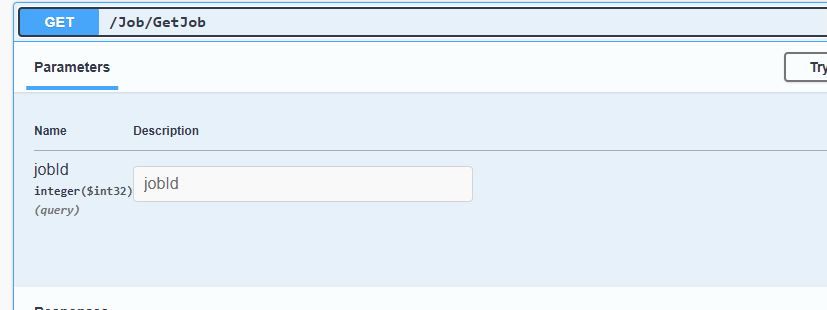

**Response**
The Response is **applicatio/json -- boolean**

```
{
  "id": 0,
  "title": "string",
  "companyName": "string",
  "description": "string",
  "location": "string",
  "workType": "string",
  "locationType": "string",
  "category": "string",
  "postedDate": "2024-09-09T19:47:46.643Z",
  "isActive": true,
  "closingDate": "2024-09-09T19:47:46.643Z",
  "userId": "string",
  "user": {
    "id": "string",
    "userName": "string",
    "normalizedUserName": "string",
    "email": "string",
    "normalizedEmail": "string",
    "emailConfirmed": true,
    "passwordHash": "string",
    "securityStamp": "string",
    "concurrencyStamp": "string",
    "phoneNumber": "string",
    "phoneNumberConfirmed": true,
    "twoFactorEnabled": true,
    "lockoutEnd": "2024-09-09T19:47:46.643Z",
    "lockoutEnabled": true,
    "accessFailedCount": 0,
    "firstName": "string",
    "lastName": "string",
    "birthday": "string",
    "pictureURL": "string",
    "educations": [
      {
        "id": 0,
        "school": "string",
        "degree": "string",
        "fieldOfStudy": "string",
        "startDate": "string",
        "endDate": "string",
        "grade": "string",
        "description": "string",
        "userId": "string",
        "user": "string"
      }
    ],
    "experiences": [
      {
        "id": 0,
        "title": "string",
        "employmentType": "string",
        "companyName": "string",
        "location": "string",
        "locationType": "string",
        "startDate": "2024-09-09T19:47:46.643Z",
        "endDate": "2024-09-09T19:47:46.643Z",
        "currentJob": true,
        "description": "string",
        "userId": "string",
        "user": "string"
      }
    ],
    "posts": [
      {
        "id": 0,
        "title": "string",
        "content": "string",
        "createdAt": "2024-09-09T19:47:46.643Z",
        "updateAt": "2024-09-09T19:47:46.643Z",
        "pictureUrls": [
          "string"
        ],
        "videoUrls": [
          "string"
        ],
        "reactionsCount": 0,
        "commentsCount": 0,
        "comments": [
          {
            "id": 0,
            "content": "string",
            "createdAt": "2024-09-09T19:47:46.643Z",
            "postId": 0,
            "post": "string",
            "username": "string"
          }
        ],
        "reactions": [
          {
            "id": 0,
            "reactionType": "string",
            "postId": 0,
            "post": "string",
            "username": "string"
          }
        ],
        "isLikedByCurrentUser": true,
        "userId": "string",
        "user": "string"
      }
    ],
    "connectedUsers": [
      "string"
    ],
    "pendingRequestUsers": [
      "string"
    ],
    "inComingRequestUsers": [
      "string"
    ],
    "postedJobs": [
      "string"
    ]
  },
  "jobApplications": [
    {
      "id": 0,
      "jobId": 0,
      "job": "string",
      "username": "string",
      "appliedDate": "2024-09-09T19:47:46.643Z",
      "coverLetter": "string",
      "status": 0
    }
  ]
}
```

## GetAllJobs
**Get**
`/Job/GetAllJobs`

**Request**
The Request is **multipart/form-data**

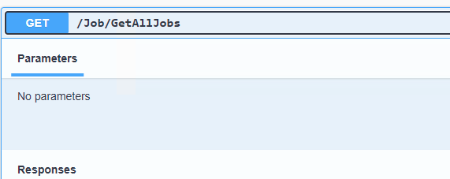

**Response**
The Response is **applicatio/json -- boolean**

```
[
  {
    "id": 0,
    "title": "string",
    "companyName": "string",
    "description": "string",
    "location": "string",
    "workType": "string",
    "locationType": "string",
    "category": "string",
    "postedDate": "2024-09-09T19:49:48.092Z",
    "isActive": true,
    "closingDate": "2024-09-09T19:49:48.092Z",
    "userId": "string",
    "user": {
      "id": "string",
      "userName": "string",
      "normalizedUserName": "string",
      "email": "string",
      "normalizedEmail": "string",
      "emailConfirmed": true,
      "passwordHash": "string",
      "securityStamp": "string",
      "concurrencyStamp": "string",
      "phoneNumber": "string",
      "phoneNumberConfirmed": true,
      "twoFactorEnabled": true,
      "lockoutEnd": "2024-09-09T19:49:48.092Z",
      "lockoutEnabled": true,
      "accessFailedCount": 0,
      "firstName": "string",
      "lastName": "string",
      "birthday": "string",
      "pictureURL": "string",
      "educations": [
        {
          "id": 0,
          "school": "string",
          "degree": "string",
          "fieldOfStudy": "string",
          "startDate": "string",
          "endDate": "string",
          "grade": "string",
          "description": "string",
          "userId": "string",
          "user": "string"
        }
      ],
      "experiences": [
        {
          "id": 0,
          "title": "string",
          "employmentType": "string",
          "companyName": "string",
          "location": "string",
          "locationType": "string",
          "startDate": "2024-09-09T19:49:48.092Z",
          "endDate": "2024-09-09T19:49:48.092Z",
          "currentJob": true,
          "description": "string",
          "userId": "string",
          "user": "string"
        }
      ],
      "posts": [
        {
          "id": 0,
          "title": "string",
          "content": "string",
          "createdAt": "2024-09-09T19:49:48.092Z",
          "updateAt": "2024-09-09T19:49:48.092Z",
          "pictureUrls": [
            "string"
          ],
          "videoUrls": [
            "string"
          ],
          "reactionsCount": 0,
          "commentsCount": 0,
          "comments": [
            {
              "id": 0,
              "content": "string",
              "createdAt": "2024-09-09T19:49:48.092Z",
              "postId": 0,
              "post": "string",
              "username": "string"
            }
          ],
          "reactions": [
            {
              "id": 0,
              "reactionType": "string",
              "postId": 0,
              "post": "string",
              "username": "string"
            }
          ],
          "isLikedByCurrentUser": true,
          "userId": "string",
          "user": "string"
        }
      ],
      "connectedUsers": [
        "string"
      ],
      "pendingRequestUsers": [
        "string"
      ],
      "inComingRequestUsers": [
        "string"
      ],
      "postedJobs": [
        "string"
      ]
    },
    "jobApplications": [
      {
        "id": 0,
        "jobId": 0,
        "job": "string",
        "username": "string",
        "appliedDate": "2024-09-09T19:49:48.092Z",
        "coverLetter": "string",
        "status": 0
      }
    ]
  }
]
```

## GetAllOpenJobs
**Get**
`/Job/GetAllOpenJobs`

**Request**
The Request is **multipart/form-data**

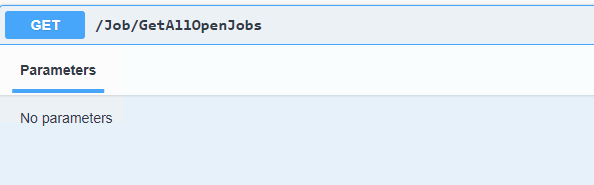

**Response**
The Response is **applicatio/json -- boolean**

```
[
  {
    "id": 0,
    "title": "string",
    "companyName": "string",
    "description": "string",
    "location": "string",
    "workType": "string",
    "locationType": "string",
    "category": "string",
    "postedDate": "2024-09-09T19:50:39.660Z",
    "isActive": true,
    "closingDate": "2024-09-09T19:50:39.660Z",
    "userId": "string",
    "user": {
      "id": "string",
      "userName": "string",
      "normalizedUserName": "string",
      "email": "string",
      "normalizedEmail": "string",
      "emailConfirmed": true,
      "passwordHash": "string",
      "securityStamp": "string",
      "concurrencyStamp": "string",
      "phoneNumber": "string",
      "phoneNumberConfirmed": true,
      "twoFactorEnabled": true,
      "lockoutEnd": "2024-09-09T19:50:39.660Z",
      "lockoutEnabled": true,
      "accessFailedCount": 0,
      "firstName": "string",
      "lastName": "string",
      "birthday": "string",
      "pictureURL": "string",
      "educations": [
        {
          "id": 0,
          "school": "string",
          "degree": "string",
          "fieldOfStudy": "string",
          "startDate": "string",
          "endDate": "string",
          "grade": "string",
          "description": "string",
          "userId": "string",
          "user": "string"
        }
      ],
      "experiences": [
        {
          "id": 0,
          "title": "string",
          "employmentType": "string",
          "companyName": "string",
          "location": "string",
          "locationType": "string",
          "startDate": "2024-09-09T19:50:39.660Z",
          "endDate": "2024-09-09T19:50:39.660Z",
          "currentJob": true,
          "description": "string",
          "userId": "string",
          "user": "string"
        }
      ],
      "posts": [
        {
          "id": 0,
          "title": "string",
          "content": "string",
          "createdAt": "2024-09-09T19:50:39.660Z",
          "updateAt": "2024-09-09T19:50:39.660Z",
          "pictureUrls": [
            "string"
          ],
          "videoUrls": [
            "string"
          ],
          "reactionsCount": 0,
          "commentsCount": 0,
          "comments": [
            {
              "id": 0,
              "content": "string",
              "createdAt": "2024-09-09T19:50:39.660Z",
              "postId": 0,
              "post": "string",
              "username": "string"
            }
          ],
          "reactions": [
            {
              "id": 0,
              "reactionType": "string",
              "postId": 0,
              "post": "string",
              "username": "string"
            }
          ],
          "isLikedByCurrentUser": true,
          "userId": "string",
          "user": "string"
        }
      ],
      "connectedUsers": [
        "string"
      ],
      "pendingRequestUsers": [
        "string"
      ],
      "inComingRequestUsers": [
        "string"
      ],
      "postedJobs": [
        "string"
      ]
    },
    "jobApplications": [
      {
        "id": 0,
        "jobId": 0,
        "job": "string",
        "username": "string",
        "appliedDate": "2024-09-09T19:50:39.660Z",
        "coverLetter": "string",
        "status": 0
      }
    ]
  }
]
```

## GetAllCloseJobs
**Get**
`/Job/GetAllCloseJobs`

**Request**
The Request is **multipart/form-data**

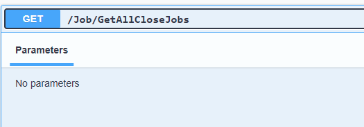

**Response**
The Response is **applicatio/json -- boolean**

```
[
  {
    "id": 0,
    "title": "string",
    "companyName": "string",
    "description": "string",
    "location": "string",
    "workType": "string",
    "locationType": "string",
    "category": "string",
    "postedDate": "2024-09-09T19:51:14.093Z",
    "isActive": true,
    "closingDate": "2024-09-09T19:51:14.093Z",
    "userId": "string",
    "user": {
      "id": "string",
      "userName": "string",
      "normalizedUserName": "string",
      "email": "string",
      "normalizedEmail": "string",
      "emailConfirmed": true,
      "passwordHash": "string",
      "securityStamp": "string",
      "concurrencyStamp": "string",
      "phoneNumber": "string",
      "phoneNumberConfirmed": true,
      "twoFactorEnabled": true,
      "lockoutEnd": "2024-09-09T19:51:14.093Z",
      "lockoutEnabled": true,
      "accessFailedCount": 0,
      "firstName": "string",
      "lastName": "string",
      "birthday": "string",
      "pictureURL": "string",
      "educations": [
        {
          "id": 0,
          "school": "string",
          "degree": "string",
          "fieldOfStudy": "string",
          "startDate": "string",
          "endDate": "string",
          "grade": "string",
          "description": "string",
          "userId": "string",
          "user": "string"
        }
      ],
      "experiences": [
        {
          "id": 0,
          "title": "string",
          "employmentType": "string",
          "companyName": "string",
          "location": "string",
          "locationType": "string",
          "startDate": "2024-09-09T19:51:14.093Z",
          "endDate": "2024-09-09T19:51:14.093Z",
          "currentJob": true,
          "description": "string",
          "userId": "string",
          "user": "string"
        }
      ],
      "posts": [
        {
          "id": 0,
          "title": "string",
          "content": "string",
          "createdAt": "2024-09-09T19:51:14.093Z",
          "updateAt": "2024-09-09T19:51:14.093Z",
          "pictureUrls": [
            "string"
          ],
          "videoUrls": [
            "string"
          ],
          "reactionsCount": 0,
          "commentsCount": 0,
          "comments": [
            {
              "id": 0,
              "content": "string",
              "createdAt": "2024-09-09T19:51:14.093Z",
              "postId": 0,
              "post": "string",
              "username": "string"
            }
          ],
          "reactions": [
            {
              "id": 0,
              "reactionType": "string",
              "postId": 0,
              "post": "string",
              "username": "string"
            }
          ],
          "isLikedByCurrentUser": true,
          "userId": "string",
          "user": "string"
        }
      ],
      "connectedUsers": [
        "string"
      ],
      "pendingRequestUsers": [
        "string"
      ],
      "inComingRequestUsers": [
        "string"
      ],
      "postedJobs": [
        "string"
      ]
    },
    "jobApplications": [
      {
        "id": 0,
        "jobId": 0,
        "job": "string",
        "username": "string",
        "appliedDate": "2024-09-09T19:51:14.093Z",
        "coverLetter": "string",
        "status": 0
      }
    ]
  }
]
```

## ApplyForJob
**Post**
`/Job/ApplyForJob`

**Request**
The Request is **multipart/form-data**

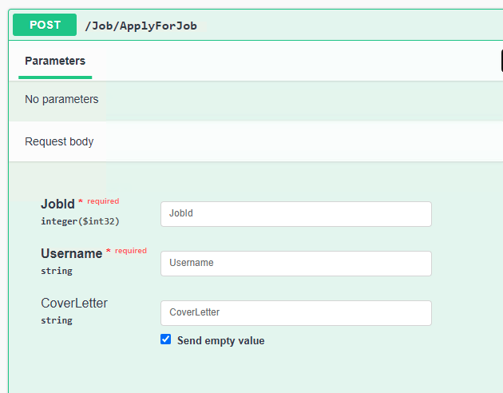

**Response**
The Response is **applicatio/json -- boolean**

```
{
  "id": 0,
  "jobId": 0,
  "job": {
    "id": 0,
    "title": "string",
    "companyName": "string",
    "description": "string",
    "location": "string",
    "workType": "string",
    "locationType": "string",
    "category": "string",
    "postedDate": "2024-09-09T19:51:59.912Z",
    "isActive": true,
    "closingDate": "2024-09-09T19:51:59.912Z",
    "userId": "string",
    "user": {
      "id": "string",
      "userName": "string",
      "normalizedUserName": "string",
      "email": "string",
      "normalizedEmail": "string",
      "emailConfirmed": true,
      "passwordHash": "string",
      "securityStamp": "string",
      "concurrencyStamp": "string",
      "phoneNumber": "string",
      "phoneNumberConfirmed": true,
      "twoFactorEnabled": true,
      "lockoutEnd": "2024-09-09T19:51:59.912Z",
      "lockoutEnabled": true,
      "accessFailedCount": 0,
      "firstName": "string",
      "lastName": "string",
      "birthday": "string",
      "pictureURL": "string",
      "educations": [
        {
          "id": 0,
          "school": "string",
          "degree": "string",
          "fieldOfStudy": "string",
          "startDate": "string",
          "endDate": "string",
          "grade": "string",
          "description": "string",
          "userId": "string",
          "user": "string"
        }
      ],
      "experiences": [
        {
          "id": 0,
          "title": "string",
          "employmentType": "string",
          "companyName": "string",
          "location": "string",
          "locationType": "string",
          "startDate": "2024-09-09T19:51:59.912Z",
          "endDate": "2024-09-09T19:51:59.912Z",
          "currentJob": true,
          "description": "string",
          "userId": "string",
          "user": "string"
        }
      ],
      "posts": [
        {
          "id": 0,
          "title": "string",
          "content": "string",
          "createdAt": "2024-09-09T19:51:59.912Z",
          "updateAt": "2024-09-09T19:51:59.912Z",
          "pictureUrls": [
            "string"
          ],
          "videoUrls": [
            "string"
          ],
          "reactionsCount": 0,
          "commentsCount": 0,
          "comments": [
            {
              "id": 0,
              "content": "string",
              "createdAt": "2024-09-09T19:51:59.912Z",
              "postId": 0,
              "post": "string",
              "username": "string"
            }
          ],
          "reactions": [
            {
              "id": 0,
              "reactionType": "string",
              "postId": 0,
              "post": "string",
              "username": "string"
            }
          ],
          "isLikedByCurrentUser": true,
          "userId": "string",
          "user": "string"
        }
      ],
      "connectedUsers": [
        "string"
      ],
      "pendingRequestUsers": [
        "string"
      ],
      "inComingRequestUsers": [
        "string"
      ],
      "postedJobs": [
        "string"
      ]
    },
    "jobApplications": [
      "string"
    ]
  },
  "username": "string",
  "appliedDate": "2024-09-09T19:51:59.912Z",
  "coverLetter": "string",
  "status": 0
}
```

## GetUserPostedJobs
**Get**
`/Job/GetUserPostedJobs`

**Request**
The Request is **multipart/form-data**

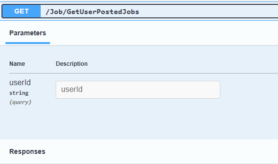

**Response**
The Response is **applicatio/json -- boolean**

```
[
  {
    "id": 0,
    "title": "string",
    "companyName": "string",
    "description": "string",
    "location": "string",
    "workType": "string",
    "locationType": "string",
    "category": "string",
    "postedDate": "2024-09-09T19:53:19.286Z",
    "isActive": true,
    "closingDate": "2024-09-09T19:53:19.286Z",
    "userId": "string",
    "user": {
      "id": "string",
      "userName": "string",
      "normalizedUserName": "string",
      "email": "string",
      "normalizedEmail": "string",
      "emailConfirmed": true,
      "passwordHash": "string",
      "securityStamp": "string",
      "concurrencyStamp": "string",
      "phoneNumber": "string",
      "phoneNumberConfirmed": true,
      "twoFactorEnabled": true,
      "lockoutEnd": "2024-09-09T19:53:19.286Z",
      "lockoutEnabled": true,
      "accessFailedCount": 0,
      "firstName": "string",
      "lastName": "string",
      "birthday": "string",
      "pictureURL": "string",
      "educations": [
        {
          "id": 0,
          "school": "string",
          "degree": "string",
          "fieldOfStudy": "string",
          "startDate": "string",
          "endDate": "string",
          "grade": "string",
          "description": "string",
          "userId": "string",
          "user": "string"
        }
      ],
      "experiences": [
        {
          "id": 0,
          "title": "string",
          "employmentType": "string",
          "companyName": "string",
          "location": "string",
          "locationType": "string",
          "startDate": "2024-09-09T19:53:19.286Z",
          "endDate": "2024-09-09T19:53:19.286Z",
          "currentJob": true,
          "description": "string",
          "userId": "string",
          "user": "string"
        }
      ],
      "posts": [
        {
          "id": 0,
          "title": "string",
          "content": "string",
          "createdAt": "2024-09-09T19:53:19.286Z",
          "updateAt": "2024-09-09T19:53:19.286Z",
          "pictureUrls": [
            "string"
          ],
          "videoUrls": [
            "string"
          ],
          "reactionsCount": 0,
          "commentsCount": 0,
          "comments": [
            {
              "id": 0,
              "content": "string",
              "createdAt": "2024-09-09T19:53:19.286Z",
              "postId": 0,
              "post": "string",
              "username": "string"
            }
          ],
          "reactions": [
            {
              "id": 0,
              "reactionType": "string",
              "postId": 0,
              "post": "string",
              "username": "string"
            }
          ],
          "isLikedByCurrentUser": true,
          "userId": "string",
          "user": "string"
        }
      ],
      "connectedUsers": [
        "string"
      ],
      "pendingRequestUsers": [
        "string"
      ],
      "inComingRequestUsers": [
        "string"
      ],
      "postedJobs": [
        "string"
      ]
    },
    "jobApplications": [
      {
        "id": 0,
        "jobId": 0,
        "job": "string",
        "username": "string",
        "appliedDate": "2024-09-09T19:53:19.286Z",
        "coverLetter": "string",
        "status": 0
      }
    ]
  }
]
```

## GetAppliedUserJobs
**Get**
`/Job/GetAppliedUserJobs`

**Request**
The Request is **multipart/form-data**

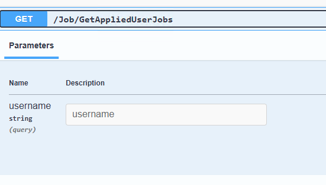

**Response**
The Response is **applicatio/json -- boolean**

```
[
  {
    "id": 0,
    "jobId": 0,
    "job": {
      "id": 0,
      "title": "string",
      "companyName": "string",
      "description": "string",
      "location": "string",
      "workType": "string",
      "locationType": "string",
      "category": "string",
      "postedDate": "2024-09-09T19:53:53.200Z",
      "isActive": true,
      "closingDate": "2024-09-09T19:53:53.200Z",
      "userId": "string",
      "user": {
        "id": "string",
        "userName": "string",
        "normalizedUserName": "string",
        "email": "string",
        "normalizedEmail": "string",
        "emailConfirmed": true,
        "passwordHash": "string",
        "securityStamp": "string",
        "concurrencyStamp": "string",
        "phoneNumber": "string",
        "phoneNumberConfirmed": true,
        "twoFactorEnabled": true,
        "lockoutEnd": "2024-09-09T19:53:53.200Z",
        "lockoutEnabled": true,
        "accessFailedCount": 0,
        "firstName": "string",
        "lastName": "string",
        "birthday": "string",
        "pictureURL": "string",
        "educations": [
          {
            "id": 0,
            "school": "string",
            "degree": "string",
            "fieldOfStudy": "string",
            "startDate": "string",
            "endDate": "string",
            "grade": "string",
            "description": "string",
            "userId": "string",
            "user": "string"
          }
        ],
        "experiences": [
          {
            "id": 0,
            "title": "string",
            "employmentType": "string",
            "companyName": "string",
            "location": "string",
            "locationType": "string",
            "startDate": "2024-09-09T19:53:53.200Z",
            "endDate": "2024-09-09T19:53:53.200Z",
            "currentJob": true,
            "description": "string",
            "userId": "string",
            "user": "string"
          }
        ],
        "posts": [
          {
            "id": 0,
            "title": "string",
            "content": "string",
            "createdAt": "2024-09-09T19:53:53.200Z",
            "updateAt": "2024-09-09T19:53:53.200Z",
            "pictureUrls": [
              "string"
            ],
            "videoUrls": [
              "string"
            ],
            "reactionsCount": 0,
            "commentsCount": 0,
            "comments": [
              {
                "id": 0,
                "content": "string",
                "createdAt": "2024-09-09T19:53:53.200Z",
                "postId": 0,
                "post": "string",
                "username": "string"
              }
            ],
            "reactions": [
              {
                "id": 0,
                "reactionType": "string",
                "postId": 0,
                "post": "string",
                "username": "string"
              }
            ],
            "isLikedByCurrentUser": true,
            "userId": "string",
            "user": "string"
          }
        ],
        "connectedUsers": [
          "string"
        ],
        "pendingRequestUsers": [
          "string"
        ],
        "inComingRequestUsers": [
          "string"
        ],
        "postedJobs": [
          "string"
        ]
      },
      "jobApplications": [
        "string"
      ]
    },
    "username": "string",
    "appliedDate": "2024-09-09T19:53:53.200Z",
    "coverLetter": "string",
    "status": 0
  }
]
```

## GetUserStatusJobs
**Get**
`/Job/GetUserStatusJobs`

**Request**
The Request is **multipart/form-data**

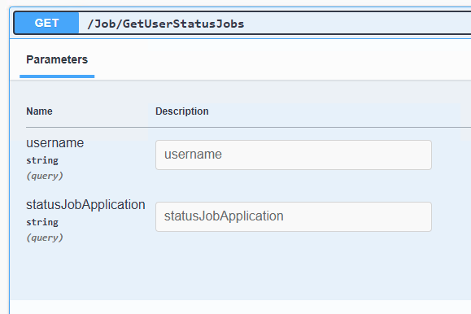

**Response**
The Response is **applicatio/json -- boolean**

```
[
  {
    "id": 0,
    "jobId": 0,
    "job": {
      "id": 0,
      "title": "string",
      "companyName": "string",
      "description": "string",
      "location": "string",
      "workType": "string",
      "locationType": "string",
      "category": "string",
      "postedDate": "2024-09-09T19:54:37.249Z",
      "isActive": true,
      "closingDate": "2024-09-09T19:54:37.249Z",
      "userId": "string",
      "user": {
        "id": "string",
        "userName": "string",
        "normalizedUserName": "string",
        "email": "string",
        "normalizedEmail": "string",
        "emailConfirmed": true,
        "passwordHash": "string",
        "securityStamp": "string",
        "concurrencyStamp": "string",
        "phoneNumber": "string",
        "phoneNumberConfirmed": true,
        "twoFactorEnabled": true,
        "lockoutEnd": "2024-09-09T19:54:37.249Z",
        "lockoutEnabled": true,
        "accessFailedCount": 0,
        "firstName": "string",
        "lastName": "string",
        "birthday": "string",
        "pictureURL": "string",
        "educations": [
          {
            "id": 0,
            "school": "string",
            "degree": "string",
            "fieldOfStudy": "string",
            "startDate": "string",
            "endDate": "string",
            "grade": "string",
            "description": "string",
            "userId": "string",
            "user": "string"
          }
        ],
        "experiences": [
          {
            "id": 0,
            "title": "string",
            "employmentType": "string",
            "companyName": "string",
            "location": "string",
            "locationType": "string",
            "startDate": "2024-09-09T19:54:37.249Z",
            "endDate": "2024-09-09T19:54:37.249Z",
            "currentJob": true,
            "description": "string",
            "userId": "string",
            "user": "string"
          }
        ],
        "posts": [
          {
            "id": 0,
            "title": "string",
            "content": "string",
            "createdAt": "2024-09-09T19:54:37.249Z",
            "updateAt": "2024-09-09T19:54:37.249Z",
            "pictureUrls": [
              "string"
            ],
            "videoUrls": [
              "string"
            ],
            "reactionsCount": 0,
            "commentsCount": 0,
            "comments": [
              {
                "id": 0,
                "content": "string",
                "createdAt": "2024-09-09T19:54:37.249Z",
                "postId": 0,
                "post": "string",
                "username": "string"
              }
            ],
            "reactions": [
              {
                "id": 0,
                "reactionType": "string",
                "postId": 0,
                "post": "string",
                "username": "string"
              }
            ],
            "isLikedByCurrentUser": true,
            "userId": "string",
            "user": "string"
          }
        ],
        "connectedUsers": [
          "string"
        ],
        "pendingRequestUsers": [
          "string"
        ],
        "inComingRequestUsers": [
          "string"
        ],
        "postedJobs": [
          "string"
        ]
      },
      "jobApplications": [
        "string"
      ]
    },
    "username": "string",
    "appliedDate": "2024-09-09T19:54:37.249Z",
    "coverLetter": "string",
    "status": 0
  }
]
```

## AcceptedJobApplication
**Put**
`/Job/AcceptedJobApplication`

**Request**
The Request is **multipart/form-data**

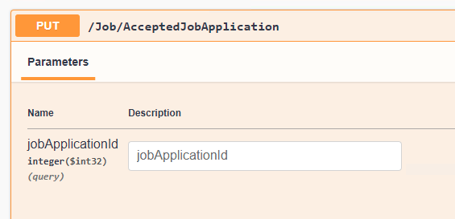

**Response**
The Response 

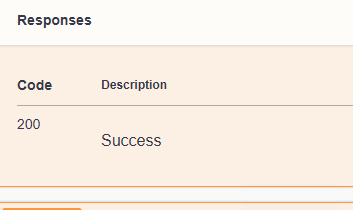

## RejectJobApplication
**Put**
`/Job/AcceptedJobApplication`

**Request**
The Request is **multipart/form-data**

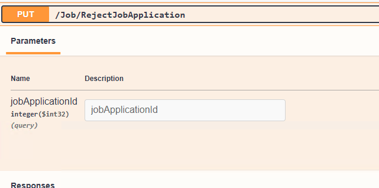


**Response**
The Response is 

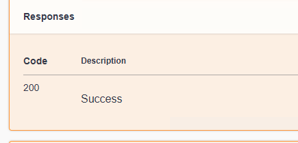

## WithdrawnJobApplication
**Put**
`/Job/WithdrawnJobApplication`

**Request**
The Request is **multipart/form-data**

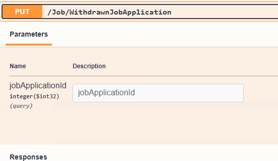

**Response**
The Response is 

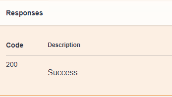


## GetFilteredJobs
**Get**
`/Job/GetFilteredJobs`

**Request**
The Request is **multipart/form-data**
The username for User where checked the job list. User who is connected

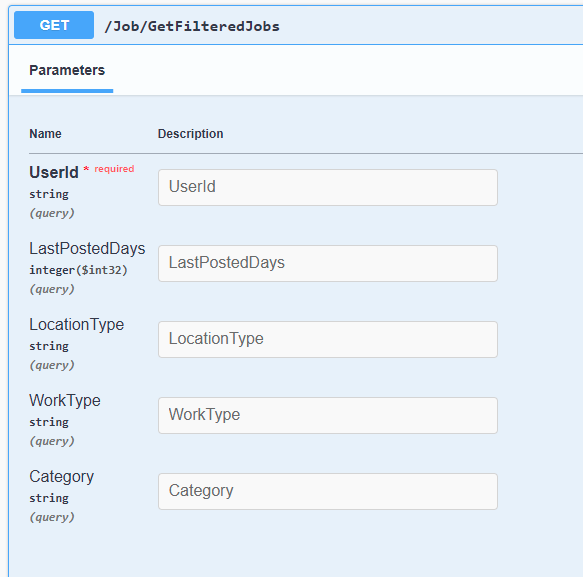

**Response**
The Response is 

```
[
  {
    "id": 0,
    "title": "string",
    "companyName": "string",
    "description": "string",
    "location": "string",
    "workType": "string",
    "locationType": "string",
    "category": "string",
    "postedDate": "2024-09-09T19:59:03.368Z",
    "isActive": true,
    "closingDate": "2024-09-09T19:59:03.368Z",
    "userId": "string",
    "user": {
      "id": "string",
      "userName": "string",
      "normalizedUserName": "string",
      "email": "string",
      "normalizedEmail": "string",
      "emailConfirmed": true,
      "passwordHash": "string",
      "securityStamp": "string",
      "concurrencyStamp": "string",
      "phoneNumber": "string",
      "phoneNumberConfirmed": true,
      "twoFactorEnabled": true,
      "lockoutEnd": "2024-09-09T19:59:03.368Z",
      "lockoutEnabled": true,
      "accessFailedCount": 0,
      "firstName": "string",
      "lastName": "string",
      "birthday": "string",
      "pictureURL": "string",
      "educations": [
        {
          "id": 0,
          "school": "string",
          "degree": "string",
          "fieldOfStudy": "string",
          "startDate": "string",
          "endDate": "string",
          "grade": "string",
          "description": "string",
          "userId": "string",
          "user": "string"
        }
      ],
      "experiences": [
        {
          "id": 0,
          "title": "string",
          "employmentType": "string",
          "companyName": "string",
          "location": "string",
          "locationType": "string",
          "startDate": "2024-09-09T19:59:03.369Z",
          "endDate": "2024-09-09T19:59:03.369Z",
          "currentJob": true,
          "description": "string",
          "userId": "string",
          "user": "string"
        }
      ],
      "posts": [
        {
          "id": 0,
          "title": "string",
          "content": "string",
          "createdAt": "2024-09-09T19:59:03.369Z",
          "updateAt": "2024-09-09T19:59:03.369Z",
          "pictureUrls": [
            "string"
          ],
          "videoUrls": [
            "string"
          ],
          "reactionsCount": 0,
          "commentsCount": 0,
          "comments": [
            {
              "id": 0,
              "content": "string",
              "createdAt": "2024-09-09T19:59:03.369Z",
              "postId": 0,
              "post": "string",
              "username": "string"
            }
          ],
          "reactions": [
            {
              "id": 0,
              "reactionType": "string",
              "postId": 0,
              "post": "string",
              "username": "string"
            }
          ],
          "isLikedByCurrentUser": true,
          "userId": "string",
          "user": "string"
        }
      ],
      "connectedUsers": [
        "string"
      ],
      "pendingRequestUsers": [
        "string"
      ],
      "inComingRequestUsers": [
        "string"
      ],
      "postedJobs": [
        "string"
      ]
    },
    "jobApplications": [
      {
        "id": 0,
        "jobId": 0,
        "job": "string",
        "username": "string",
        "appliedDate": "2024-09-09T19:59:03.369Z",
        "coverLetter": "string",
        "status": 0
      }
    ]
  }
]
```


## CloseJob
**Put**
`/Job/CloseJob`

**Request**
The Request is **multipart/form-data**

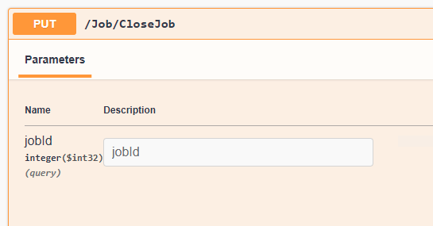

**Response**
The Response is 

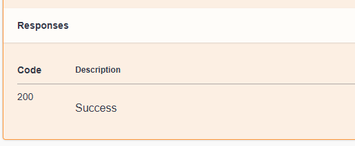

