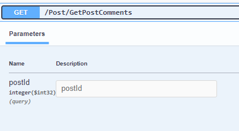
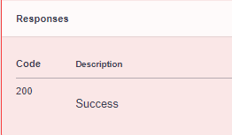

# Post Controller

Set the Url from Api:
For example the BackEnd Api url is: http://localhost:5175


## CreatePost
**Post**
`/Post/CreatePost`


**Request**
The Request is **multipart/form-data**


**Response**
The Response is **applicatio/json -- boolean**

```
{
  "id": 0,
  "title": "string",
  "content": "string",
  "createdAt": "2024-09-10T21:59:02.051Z",
  "updateAt": "2024-09-10T21:59:02.051Z",
  "pictureUrls": [
    "string"
  ],
  "videoUrls": [
    "string"
  ],
  "voiceUrls": [
    "string"
  ],
  "reactionsCount": 0,
  "commentsCount": 0,
  "comments": [
    {
      "id": 0,
      "content": "string",
      "createdAt": "2024-09-10T21:59:02.051Z",
      "postId": 0,
      "post": "string",
      "username": "string"
    }
  ],
  "reactions": [
    {
      "id": 0,
      "reactionType": "string",
      "postId": 0,
      "post": "string",
      "username": "string"
    }
  ],
  "isLikedByCurrentUser": true,
  "userId": "string",
  "user": {
    "id": "string",
    "userName": "string",
    "normalizedUserName": "string",
    "email": "string",
    "normalizedEmail": "string",
    "emailConfirmed": true,
    "passwordHash": "string",
    "securityStamp": "string",
    "concurrencyStamp": "string",
    "phoneNumber": "string",
    "phoneNumberConfirmed": true,
    "twoFactorEnabled": true,
    "lockoutEnd": "2024-09-10T21:59:02.051Z",
    "lockoutEnabled": true,
    "accessFailedCount": 0,
    "firstName": "string",
    "lastName": "string",
    "birthday": "string",
    "pictureURL": "string",
    "coverLetterURL": "string",
    "webPage": "string",
    "educations": [
      {
        "id": 0,
        "school": "string",
        "degree": "string",
        "fieldOfStudy": "string",
        "startDate": "2024-09-10T21:59:02.051Z",
        "endDate": "2024-09-10T21:59:02.051Z",
        "grade": "string",
        "description": "string",
        "userId": "string",
        "user": "string"
      }
    ],
    "experiences": [
      {
        "id": 0,
        "title": "string",
        "employmentType": "string",
        "companyName": "string",
        "location": "string",
        "locationType": "string",
        "startDate": "2024-09-10T21:59:02.051Z",
        "endDate": "2024-09-10T21:59:02.051Z",
        "currentJob": true,
        "description": "string",
        "userId": "string",
        "user": "string"
      }
    ],
    "posts": [
      "string"
    ],
    "connectedUsers": [
      "string"
    ],
    "pendingRequestUsers": [
      "string"
    ],
    "inComingRequestUsers": [
      "string"
    ],
    "postedJobs": [
      {
        "id": 0,
        "title": "string",
        "companyName": "string",
        "description": "string",
        "location": "string",
        "workType": "string",
        "locationType": "string",
        "category": "string",
        "postedDate": "2024-09-10T21:59:02.051Z",
        "isActive": true,
        "closingDate": "2024-09-10T21:59:02.051Z",
        "userId": "string",
        "user": "string",
        "jobApplications": [
          {
            "id": 0,
            "jobId": 0,
            "job": "string",
            "username": "string",
            "appliedDate": "2024-09-10T21:59:02.051Z",
            "coverLetter": "string",
            "status": 0
          }
        ]
      }
    ]
  }
}
```


## GetPosts
**Get**
`/Post/GetPosts`


**Request**
The Request is **Query params**


**Response**
The Response is **applicatio/json -- boolean**

```
[
  {
    "id": 0,
    "title": "string",
    "content": "string",
    "createdAt": "2024-09-03T17:17:19.400Z",
    "updateAt": "2024-09-03T17:17:19.400Z",
    "pictureUrls": [
      "string"
    ],
    "videoUrls": [
      "string"
    ],
    "reactionsCount": 0,
    "commentsCount": 0,
    "comments": [
      {
        "id": 0,
        "content": "string",
        "createdAt": "2024-09-03T17:17:19.400Z",
        "postId": 0,
        "post": "string",
        "username": "string"
      }
    ],
    "reactions": [
      {
        "id": 0,
        "reactionType": "string",
        "postId": 0,
        "post": "string",
        "username": "string"
      }
    ],
    "isLikedByCurrentUser": true,
    "userId": "string",
    "user": {
      "id": "string",
      "userName": "string",
      "normalizedUserName": "string",
      "email": "string",
      "normalizedEmail": "string",
      "emailConfirmed": true,
      "passwordHash": "string",
      "securityStamp": "string",
      "concurrencyStamp": "string",
      "phoneNumber": "string",
      "phoneNumberConfirmed": true,
      "twoFactorEnabled": true,
      "lockoutEnd": "2024-09-03T17:17:19.400Z",
      "lockoutEnabled": true,
      "accessFailedCount": 0,
      "firstName": "string",
      "lastName": "string",
      "pictureURL": "string",
      "educations": [
        {
          "id": 0,
          "school": "string",
          "degree": "string",
          "fieldOfStudy": "string",
          "startDate": "string",
          "endDate": "string",
          "grade": "string",
          "description": "string",
          "userId": "string",
          "user": "string"
        }
      ],
      "experiences": [
        {
          "id": 0,
          "title": "string",
          "employmentType": "string",
          "companyName": "string",
          "location": "string",
          "locationType": "string",
          "startDate": "2024-09-03T17:17:19.400Z",
          "endDate": "2024-09-03T17:17:19.400Z",
          "currentJob": true,
          "description": "string",
          "userId": "string",
          "user": "string"
        }
      ],
      "posts": [
        "string"
      ],
      "connectedUsers": [
        "string"
      ],
      "pendingRequestUsers": [
        "string"
      ],
      "inComingRequestUsers": [
        "string"
      ]
    }
  }
]
```

## EditPost
**Put**
`/Post/EditPosts`


**Request**
The Request is **multipart/form-data**


**Response**
The Response is **applicatio/json -- boolean**

```
{
  "id": 0,
  "title": "string",
  "content": "string",
  "createdAt": "2024-09-10T22:00:11.878Z",
  "updateAt": "2024-09-10T22:00:11.878Z",
  "pictureUrls": [
    "string"
  ],
  "videoUrls": [
    "string"
  ],
  "voiceUrls": [
    "string"
  ],
  "reactionsCount": 0,
  "commentsCount": 0,
  "comments": [
    {
      "id": 0,
      "content": "string",
      "createdAt": "2024-09-10T22:00:11.878Z",
      "postId": 0,
      "post": "string",
      "username": "string"
    }
  ],
  "reactions": [
    {
      "id": 0,
      "reactionType": "string",
      "postId": 0,
      "post": "string",
      "username": "string"
    }
  ],
  "isLikedByCurrentUser": true,
  "userId": "string",
  "user": {
    "id": "string",
    "userName": "string",
    "normalizedUserName": "string",
    "email": "string",
    "normalizedEmail": "string",
    "emailConfirmed": true,
    "passwordHash": "string",
    "securityStamp": "string",
    "concurrencyStamp": "string",
    "phoneNumber": "string",
    "phoneNumberConfirmed": true,
    "twoFactorEnabled": true,
    "lockoutEnd": "2024-09-10T22:00:11.878Z",
    "lockoutEnabled": true,
    "accessFailedCount": 0,
    "firstName": "string",
    "lastName": "string",
    "birthday": "string",
    "pictureURL": "string",
    "coverLetterURL": "string",
    "webPage": "string",
    "educations": [
      {
        "id": 0,
        "school": "string",
        "degree": "string",
        "fieldOfStudy": "string",
        "startDate": "2024-09-10T22:00:11.878Z",
        "endDate": "2024-09-10T22:00:11.878Z",
        "grade": "string",
        "description": "string",
        "userId": "string",
        "user": "string"
      }
    ],
    "experiences": [
      {
        "id": 0,
        "title": "string",
        "employmentType": "string",
        "companyName": "string",
        "location": "string",
        "locationType": "string",
        "startDate": "2024-09-10T22:00:11.878Z",
        "endDate": "2024-09-10T22:00:11.878Z",
        "currentJob": true,
        "description": "string",
        "userId": "string",
        "user": "string"
      }
    ],
    "posts": [
      "string"
    ],
    "connectedUsers": [
      "string"
    ],
    "pendingRequestUsers": [
      "string"
    ],
    "inComingRequestUsers": [
      "string"
    ],
    "postedJobs": [
      {
        "id": 0,
        "title": "string",
        "companyName": "string",
        "description": "string",
        "location": "string",
        "workType": "string",
        "locationType": "string",
        "category": "string",
        "postedDate": "2024-09-10T22:00:11.878Z",
        "isActive": true,
        "closingDate": "2024-09-10T22:00:11.878Z",
        "userId": "string",
        "user": "string",
        "jobApplications": [
          {
            "id": 0,
            "jobId": 0,
            "job": "string",
            "username": "string",
            "appliedDate": "2024-09-10T22:00:11.878Z",
            "coverLetter": "string",
            "status": 0
          }
        ]
      }
    ]
  }
}
```

## DeletePost
**Delete**
`/Post/DeletePost`


**Request**
The Request is **Query Params**


**Response**
The Response is 


## CreateComment
**Post**
`/Post/CreateComment`


**Request**
The Request is **multipart/form-data**


**Response**
The Response is **applicatio/json -- boolean**

```
  "id": 0,
  "content": "string",
  "createdAt": "2024-09-03T17:19:29.449Z",
  "postId": 0,
  "post": {
    "id": 0,
    "title": "string",
    "content": "string",
    "createdAt": "2024-09-03T17:19:29.449Z",
    "updateAt": "2024-09-03T17:19:29.449Z",
    "pictureUrls": [
      "string"
    ],
    "videoUrls": [
      "string"
    ],
    "reactionsCount": 0,
    "commentsCount": 0,
    "comments": [
      "string"
    ],
    "reactions": [
      {
        "id": 0,
        "reactionType": "string",
        "postId": 0,
        "post": "string",
        "username": "string"
      }
    ],
    "isLikedByCurrentUser": true,
    "userId": "string",
    "user": {
      "id": "string",
      "userName": "string",
      "normalizedUserName": "string",
      "email": "string",
      "normalizedEmail": "string",
      "emailConfirmed": true,
      "passwordHash": "string",
      "securityStamp": "string",
      "concurrencyStamp": "string",
      "phoneNumber": "string",
      "phoneNumberConfirmed": true,
      "twoFactorEnabled": true,
      "lockoutEnd": "2024-09-03T17:19:29.449Z",
      "lockoutEnabled": true,
      "accessFailedCount": 0,
      "firstName": "string",
      "lastName": "string",
      "pictureURL": "string",
      "educations": [
        {
          "id": 0,
          "school": "string",
          "degree": "string",
          "fieldOfStudy": "string",
          "startDate": "string",
          "endDate": "string",
          "grade": "string",
          "description": "string",
          "userId": "string",
          "user": "string"
        }
      ],
      "experiences": [
        {
          "id": 0,
          "title": "string",
          "employmentType": "string",
          "companyName": "string",
          "location": "string",
          "locationType": "string",
          "startDate": "2024-09-03T17:19:29.449Z",
          "endDate": "2024-09-03T17:19:29.449Z",
          "currentJob": true,
          "description": "string",
          "userId": "string",
          "user": "string"
        }
      ],
      "posts": [
        "string"
      ],
      "connectedUsers": [
        "string"
      ],
      "pendingRequestUsers": [
        "string"
      ],
      "inComingRequestUsers": [
        "string"
      ]
    }
  },
  "username": "string"
}
```

## GetPostComments
**Get**
`/Post/GetPostComments`


**Request**
The Request is **Query Params**



**Response**
The Response is **applicatio/json -- boolean**

```
[
  {
    "id": 0,
    "content": "string",
    "createdAt": "2024-09-03T17:20:21.894Z",
    "postId": 0,
    "post": {
      "id": 0,
      "title": "string",
      "content": "string",
      "createdAt": "2024-09-03T17:20:21.894Z",
      "updateAt": "2024-09-03T17:20:21.894Z",
      "pictureUrls": [
        "string"
      ],
      "videoUrls": [
        "string"
      ],
      "reactionsCount": 0,
      "commentsCount": 0,
      "comments": [
        "string"
      ],
      "reactions": [
        {
          "id": 0,
          "reactionType": "string",
          "postId": 0,
          "post": "string",
          "username": "string"
        }
      ],
      "isLikedByCurrentUser": true,
      "userId": "string",
      "user": {
        "id": "string",
        "userName": "string",
        "normalizedUserName": "string",
        "email": "string",
        "normalizedEmail": "string",
        "emailConfirmed": true,
        "passwordHash": "string",
        "securityStamp": "string",
        "concurrencyStamp": "string",
        "phoneNumber": "string",
        "phoneNumberConfirmed": true,
        "twoFactorEnabled": true,
        "lockoutEnd": "2024-09-03T17:20:21.894Z",
        "lockoutEnabled": true,
        "accessFailedCount": 0,
        "firstName": "string",
        "lastName": "string",
        "pictureURL": "string",
        "educations": [
          {
            "id": 0,
            "school": "string",
            "degree": "string",
            "fieldOfStudy": "string",
            "startDate": "string",
            "endDate": "string",
            "grade": "string",
            "description": "string",
            "userId": "string",
            "user": "string"
          }
        ],
        "experiences": [
          {
            "id": 0,
            "title": "string",
            "employmentType": "string",
            "companyName": "string",
            "location": "string",
            "locationType": "string",
            "startDate": "2024-09-03T17:20:21.894Z",
            "endDate": "2024-09-03T17:20:21.894Z",
            "currentJob": true,
            "description": "string",
            "userId": "string",
            "user": "string"
          }
        ],
        "posts": [
          "string"
        ],
        "connectedUsers": [
          "string"
        ],
        "pendingRequestUsers": [
          "string"
        ],
        "inComingRequestUsers": [
          "string"
        ]
      }
    },
    "username": "string"
  }
]
```

## GetUserComments
**Get**
`/Post/GetUserComments`


**Request**
The Request is **Query Params**


**Response**
The Response is **applicatio/json -- boolean**

```
[
  {
    "id": 0,
    "content": "string",
    "createdAt": "2024-09-03T17:21:25.689Z",
    "postId": 0,
    "post": {
      "id": 0,
      "title": "string",
      "content": "string",
      "createdAt": "2024-09-03T17:21:25.689Z",
      "updateAt": "2024-09-03T17:21:25.689Z",
      "pictureUrls": [
        "string"
      ],
      "videoUrls": [
        "string"
      ],
      "reactionsCount": 0,
      "commentsCount": 0,
      "comments": [
        "string"
      ],
      "reactions": [
        {
          "id": 0,
          "reactionType": "string",
          "postId": 0,
          "post": "string",
          "username": "string"
        }
      ],
      "isLikedByCurrentUser": true,
      "userId": "string",
      "user": {
        "id": "string",
        "userName": "string",
        "normalizedUserName": "string",
        "email": "string",
        "normalizedEmail": "string",
        "emailConfirmed": true,
        "passwordHash": "string",
        "securityStamp": "string",
        "concurrencyStamp": "string",
        "phoneNumber": "string",
        "phoneNumberConfirmed": true,
        "twoFactorEnabled": true,
        "lockoutEnd": "2024-09-03T17:21:25.689Z",
        "lockoutEnabled": true,
        "accessFailedCount": 0,
        "firstName": "string",
        "lastName": "string",
        "pictureURL": "string",
        "educations": [
          {
            "id": 0,
            "school": "string",
            "degree": "string",
            "fieldOfStudy": "string",
            "startDate": "string",
            "endDate": "string",
            "grade": "string",
            "description": "string",
            "userId": "string",
            "user": "string"
          }
        ],
        "experiences": [
          {
            "id": 0,
            "title": "string",
            "employmentType": "string",
            "companyName": "string",
            "location": "string",
            "locationType": "string",
            "startDate": "2024-09-03T17:21:25.689Z",
            "endDate": "2024-09-03T17:21:25.689Z",
            "currentJob": true,
            "description": "string",
            "userId": "string",
            "user": "string"
          }
        ],
        "posts": [
          "string"
        ],
        "connectedUsers": [
          "string"
        ],
        "pendingRequestUsers": [
          "string"
        ],
        "inComingRequestUsers": [
          "string"
        ]
      }
    },
    "username": "string"
  }
]
```

## DeleteAllCommentsFromPost
**Delete**
`/Post/DeleteAllCommentsFromPost`


**Request**
The Request is **Query Params**


**Response**
The Response is 


## DeleteComment
**Delete**
`/Post/DeleteComment`


**Request**
The Request is **Query Params**


**Response**
The Response is 


## CreateReaction
**Post**
`/Post/CreateReaction`


**Request**
The Request is **multipart/form-data**


**Response**
The Response is **applicatio/json -- boolean**

```
{
  "id": 0,
  "reactionType": "string",
  "postId": 0,
  "post": {
    "id": 0,
    "title": "string",
    "content": "string",
    "createdAt": "2024-09-03T17:23:31.491Z",
    "updateAt": "2024-09-03T17:23:31.491Z",
    "pictureUrls": [
      "string"
    ],
    "videoUrls": [
      "string"
    ],
    "reactionsCount": 0,
    "commentsCount": 0,
    "comments": [
      {
        "id": 0,
        "content": "string",
        "createdAt": "2024-09-03T17:23:31.491Z",
        "postId": 0,
        "post": "string",
        "username": "string"
      }
    ],
    "reactions": [
      "string"
    ],
    "isLikedByCurrentUser": true,
    "userId": "string",
    "user": {
      "id": "string",
      "userName": "string",
      "normalizedUserName": "string",
      "email": "string",
      "normalizedEmail": "string",
      "emailConfirmed": true,
      "passwordHash": "string",
      "securityStamp": "string",
      "concurrencyStamp": "string",
      "phoneNumber": "string",
      "phoneNumberConfirmed": true,
      "twoFactorEnabled": true,
      "lockoutEnd": "2024-09-03T17:23:31.491Z",
      "lockoutEnabled": true,
      "accessFailedCount": 0,
      "firstName": "string",
      "lastName": "string",
      "pictureURL": "string",
      "educations": [
        {
          "id": 0,
          "school": "string",
          "degree": "string",
          "fieldOfStudy": "string",
          "startDate": "string",
          "endDate": "string",
          "grade": "string",
          "description": "string",
          "userId": "string",
          "user": "string"
        }
      ],
      "experiences": [
        {
          "id": 0,
          "title": "string",
          "employmentType": "string",
          "companyName": "string",
          "location": "string",
          "locationType": "string",
          "startDate": "2024-09-03T17:23:31.491Z",
          "endDate": "2024-09-03T17:23:31.491Z",
          "currentJob": true,
          "description": "string",
          "userId": "string",
          "user": "string"
        }
      ],
      "posts": [
        "string"
      ],
      "connectedUsers": [
        "string"
      ],
      "pendingRequestUsers": [
        "string"
      ],
      "inComingRequestUsers": [
        "string"
      ]
    }
  },
  "username": "string"
}
```

## GetPostReactions
**Get**
`/Post/GetPostReactions`


**Request**
The Request is **Query Params**


**Response**
The Response is **applicatio/json -- boolean**

```
[
  {
    "id": 0,
    "reactionType": "string",
    "postId": 0,
    "post": {
      "id": 0,
      "title": "string",
      "content": "string",
      "createdAt": "2024-09-03T17:24:21.591Z",
      "updateAt": "2024-09-03T17:24:21.591Z",
      "pictureUrls": [
        "string"
      ],
      "videoUrls": [
        "string"
      ],
      "reactionsCount": 0,
      "commentsCount": 0,
      "comments": [
        {
          "id": 0,
          "content": "string",
          "createdAt": "2024-09-03T17:24:21.591Z",
          "postId": 0,
          "post": "string",
          "username": "string"
        }
      ],
      "reactions": [
        "string"
      ],
      "isLikedByCurrentUser": true,
      "userId": "string",
      "user": {
        "id": "string",
        "userName": "string",
        "normalizedUserName": "string",
        "email": "string",
        "normalizedEmail": "string",
        "emailConfirmed": true,
        "passwordHash": "string",
        "securityStamp": "string",
        "concurrencyStamp": "string",
        "phoneNumber": "string",
        "phoneNumberConfirmed": true,
        "twoFactorEnabled": true,
        "lockoutEnd": "2024-09-03T17:24:21.591Z",
        "lockoutEnabled": true,
        "accessFailedCount": 0,
        "firstName": "string",
        "lastName": "string",
        "pictureURL": "string",
        "educations": [
          {
            "id": 0,
            "school": "string",
            "degree": "string",
            "fieldOfStudy": "string",
            "startDate": "string",
            "endDate": "string",
            "grade": "string",
            "description": "string",
            "userId": "string",
            "user": "string"
          }
        ],
        "experiences": [
          {
            "id": 0,
            "title": "string",
            "employmentType": "string",
            "companyName": "string",
            "location": "string",
            "locationType": "string",
            "startDate": "2024-09-03T17:24:21.591Z",
            "endDate": "2024-09-03T17:24:21.591Z",
            "currentJob": true,
            "description": "string",
            "userId": "string",
            "user": "string"
          }
        ],
        "posts": [
          "string"
        ],
        "connectedUsers": [
          "string"
        ],
        "pendingRequestUsers": [
          "string"
        ],
        "inComingRequestUsers": [
          "string"
        ]
      }
    },
    "username": "string"
  }
]
```

## GetUserReactions
**Get**
`/Post/GetUserReactions`


**Request**
The Request is **Query Params**


**Response**
The Response is **applicatio/json -- boolean**

```
[
  {
    "id": 0,
    "reactionType": "string",
    "postId": 0,
    "post": {
      "id": 0,
      "title": "string",
      "content": "string",
      "createdAt": "2024-09-03T17:25:48.104Z",
      "updateAt": "2024-09-03T17:25:48.104Z",
      "pictureUrls": [
        "string"
      ],
      "videoUrls": [
        "string"
      ],
      "reactionsCount": 0,
      "commentsCount": 0,
      "comments": [
        {
          "id": 0,
          "content": "string",
          "createdAt": "2024-09-03T17:25:48.104Z",
          "postId": 0,
          "post": "string",
          "username": "string"
        }
      ],
      "reactions": [
        "string"
      ],
      "isLikedByCurrentUser": true,
      "userId": "string",
      "user": {
        "id": "string",
        "userName": "string",
        "normalizedUserName": "string",
        "email": "string",
        "normalizedEmail": "string",
        "emailConfirmed": true,
        "passwordHash": "string",
        "securityStamp": "string",
        "concurrencyStamp": "string",
        "phoneNumber": "string",
        "phoneNumberConfirmed": true,
        "twoFactorEnabled": true,
        "lockoutEnd": "2024-09-03T17:25:48.104Z",
        "lockoutEnabled": true,
        "accessFailedCount": 0,
        "firstName": "string",
        "lastName": "string",
        "pictureURL": "string",
        "educations": [
          {
            "id": 0,
            "school": "string",
            "degree": "string",
            "fieldOfStudy": "string",
            "startDate": "string",
            "endDate": "string",
            "grade": "string",
            "description": "string",
            "userId": "string",
            "user": "string"
          }
        ],
        "experiences": [
          {
            "id": 0,
            "title": "string",
            "employmentType": "string",
            "companyName": "string",
            "location": "string",
            "locationType": "string",
            "startDate": "2024-09-03T17:25:48.104Z",
            "endDate": "2024-09-03T17:25:48.104Z",
            "currentJob": true,
            "description": "string",
            "userId": "string",
            "user": "string"
          }
        ],
        "posts": [
          "string"
        ],
        "connectedUsers": [
          "string"
        ],
        "pendingRequestUsers": [
          "string"
        ],
        "inComingRequestUsers": [
          "string"
        ]
      }
    },
    "username": "string"
  }
]
```

## DeleteAllReactionsFromPost
**Delete**
`/Post/DeleteAllReactionsFromPost`


**Request**
The Request is **Query Params**


**Response**
The Response is **applicatio/json -- boolean**



## DeleteReaction
**Delete**
`/Post/DeleteReaction`


**Request**
The Request is **Query Params**


**Response**
The Response is **applicatio/json -- boolean**


## GetPostsFromConnectedUsers
**Get**
`/Post/GetPostsFromConnectedUsers`


**Request**
The Request is **Query Params**


**Response**
The Response is **applicatio/json**

```
[
  {
    "id": 0,
    "title": "string",
    "content": "string",
    "createdAt": "2024-09-09T22:41:42.963Z",
    "updateAt": "2024-09-09T22:41:42.963Z",
    "pictureUrls": [
      "string"
    ],
    "videoUrls": [
      "string"
    ],
    "reactionsCount": 0,
    "commentsCount": 0,
    "comments": [
      {
        "id": 0,
        "content": "string",
        "createdAt": "2024-09-09T22:41:42.963Z",
        "postId": 0,
        "post": "string",
        "username": "string"
      }
    ],
    "reactions": [
      {
        "id": 0,
        "reactionType": "string",
        "postId": 0,
        "post": "string",
        "username": "string"
      }
    ],
    "isLikedByCurrentUser": true,
    "userId": "string",
    "user": {
      "id": "string",
      "userName": "string",
      "normalizedUserName": "string",
      "email": "string",
      "normalizedEmail": "string",
      "emailConfirmed": true,
      "passwordHash": "string",
      "securityStamp": "string",
      "concurrencyStamp": "string",
      "phoneNumber": "string",
      "phoneNumberConfirmed": true,
      "twoFactorEnabled": true,
      "lockoutEnd": "2024-09-09T22:41:42.963Z",
      "lockoutEnabled": true,
      "accessFailedCount": 0,
      "firstName": "string",
      "lastName": "string",
      "birthday": "string",
      "pictureURL": "string",
      "coverLetterURL": "string",
      "webPage": "string",
      "educations": [
        {
          "id": 0,
          "school": "string",
          "degree": "string",
          "fieldOfStudy": "string",
          "startDate": "string",
          "endDate": "string",
          "grade": "string",
          "description": "string",
          "userId": "string",
          "user": "string"
        }
      ],
      "experiences": [
        {
          "id": 0,
          "title": "string",
          "employmentType": "string",
          "companyName": "string",
          "location": "string",
          "locationType": "string",
          "startDate": "2024-09-09T22:41:42.963Z",
          "endDate": "2024-09-09T22:41:42.963Z",
          "currentJob": true,
          "description": "string",
          "userId": "string",
          "user": "string"
        }
      ],
      "posts": [
        "string"
      ],
      "connectedUsers": [
        "string"
      ],
      "pendingRequestUsers": [
        "string"
      ],
      "inComingRequestUsers": [
        "string"
      ],
      "postedJobs": [
        {
          "id": 0,
          "title": "string",
          "companyName": "string",
          "description": "string",
          "location": "string",
          "workType": "string",
          "locationType": "string",
          "category": "string",
          "postedDate": "2024-09-09T22:41:42.963Z",
          "isActive": true,
          "closingDate": "2024-09-09T22:41:42.963Z",
          "userId": "string",
          "user": "string",
          "jobApplications": [
            {
              "id": 0,
              "jobId": 0,
              "job": "string",
              "username": "string",
              "appliedDate": "2024-09-09T22:41:42.963Z",
              "coverLetter": "string",
              "status": 0
            }
          ]
        }
      ]
    }
  }
]
```


