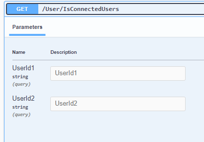
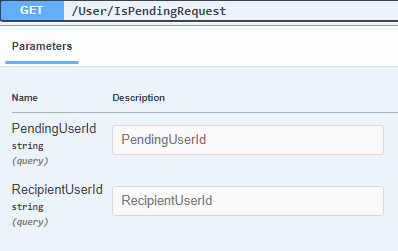

# Users Controller

Set the Url from Api:
For example the BackEnd Api url is: http://localhost:5175

## IsConnectedUsers
**Get**
`/User/IsConnectedUsers`

**Request**
The Request is **Query Params**

**Response**
The Response is **applicatio/json -- boolean**

## IsPendingRequest
**Get**
`/User/IsPendingRequest`

**Request**
The Request is **Query Params**

**Response**
The Response is **applicatio/json -- boolean**

## IsInComingRequest
**Get**
`/User/IsInComingRequest`

**Request**
The Request is **Query Params**

**Response**
The Response is **applicatio/json -- boolean**

