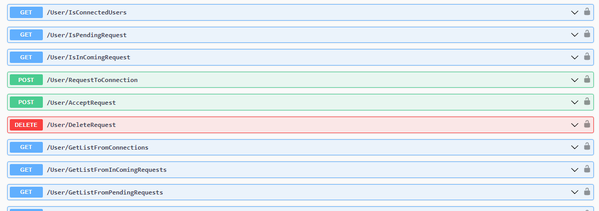
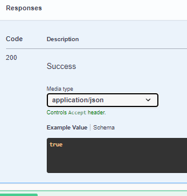
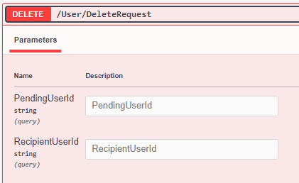
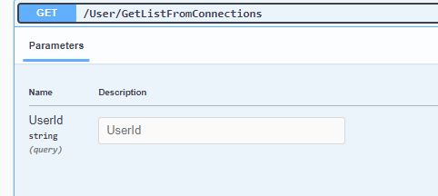

# Users Controller

Set the Url from Api:
For example the BackEnd Api url is: http://localhost:5175

All connections Endpoints is Authorized from `Professional`



## IsConnectedUsers
**Get**
`/User/IsConnectedUsers`


**Request**
The Request is **Query Params**


**Response**
The Response is **applicatio/json -- boolean**


## IsPendingRequest
**Get**
`/User/IsPendingRequest`


**Request**
The Request is **Query Params**


**Response**
The Response is **applicatio/json -- boolean**


## IsInComingRequest
**Get**
`/User/IsInComingRequest`


**Request**
The Request is **Query Params**


**Response**
The Response is **applicatio/json -- boolean**




## RequestToConnection
**Post**
`/User/RequestToConnection`


**Request**
The Request is **Query Params**


**Response**
The Response is


## AcceptRequest
**Post**
`/User/AcceptRequest`


**Request**
The Request is **Query Params**


**Response**
The Response is


## DeleteRequest
**Delete**
`/User/DeleteRequest`


**Request**
The Request is **Query Params**



**Response**
The Response is


## GetListFromConnections
**Get**
`/User/GetListFromConnections`


**Request**
The Request is **Query Params**



**Response**
The Response is

```
[
  {
    "id": "string",
    "userName": "string",
    "normalizedUserName": "string",
    "email": "string",
    "normalizedEmail": "string",
    "emailConfirmed": true,
    "passwordHash": "string",
    "securityStamp": "string",
    "concurrencyStamp": "string",
    "phoneNumber": "string",
    "phoneNumberConfirmed": true,
    "twoFactorEnabled": true,
    "lockoutEnd": "2024-08-25T13:16:30.525Z",
    "lockoutEnabled": true,
    "accessFailedCount": 0,
    "firstName": "string",
    "lastName": "string",
    "pictureURL": "string",
    "educations": [
      {
        "id": 0,
        "school": "string",
        "degree": "string",
        "fieldOfStudy": "string",
        "startDate": "string",
        "endDate": "string",
        "grade": "string",
        "description": "string",
        "userId": "string",
        "user": "string"
      }
    ],
    "experiences": [
      {
        "id": 0,
        "title": "string",
        "employmentType": "string",
        "companyName": "string",
        "location": "string",
        "locationType": "string",
        "startDate": "2024-08-25T13:16:30.525Z",
        "endDate": "2024-08-25T13:16:30.525Z",
        "currentJob": true,
        "description": "string",
        "userId": "string",
        "user": "string"
      }
    ],
    "connectedUsers": [
      "string"
    ],
    "pendingRequestUsers": [
      "string"
    ],
    "inComingRequestUsers": [
      "string"
    ]
  }
]
```

## GetListFromInComingRequests
**Get**
`/User/GetListFromInComingRequests`


**Request**
The Request is **Query Params**


**Response**
The Response is

```
[
  {
    "id": "string",
    "userName": "string",
    "normalizedUserName": "string",
    "email": "string",
    "normalizedEmail": "string",
    "emailConfirmed": true,
    "passwordHash": "string",
    "securityStamp": "string",
    "concurrencyStamp": "string",
    "phoneNumber": "string",
    "phoneNumberConfirmed": true,
    "twoFactorEnabled": true,
    "lockoutEnd": "2024-08-25T13:17:33.374Z",
    "lockoutEnabled": true,
    "accessFailedCount": 0,
    "firstName": "string",
    "lastName": "string",
    "pictureURL": "string",
    "educations": [
      {
        "id": 0,
        "school": "string",
        "degree": "string",
        "fieldOfStudy": "string",
        "startDate": "string",
        "endDate": "string",
        "grade": "string",
        "description": "string",
        "userId": "string",
        "user": "string"
      }
    ],
    "experiences": [
      {
        "id": 0,
        "title": "string",
        "employmentType": "string",
        "companyName": "string",
        "location": "string",
        "locationType": "string",
        "startDate": "2024-08-25T13:17:33.374Z",
        "endDate": "2024-08-25T13:17:33.374Z",
        "currentJob": true,
        "description": "string",
        "userId": "string",
        "user": "string"
      }
    ],
    "connectedUsers": [
      "string"
    ],
    "pendingRequestUsers": [
      "string"
    ],
    "inComingRequestUsers": [
      "string"
    ]
  }
]
```

## GetListFromPendingRequests
**Get**
`/User/GetListFromPendingRequests`


**Request**
The Request is **Query Params**


**Response**
The Response is

```
[
  {
    "id": "string",
    "userName": "string",
    "normalizedUserName": "string",
    "email": "string",
    "normalizedEmail": "string",
    "emailConfirmed": true,
    "passwordHash": "string",
    "securityStamp": "string",
    "concurrencyStamp": "string",
    "phoneNumber": "string",
    "phoneNumberConfirmed": true,
    "twoFactorEnabled": true,
    "lockoutEnd": "2024-08-25T13:18:26.397Z",
    "lockoutEnabled": true,
    "accessFailedCount": 0,
    "firstName": "string",
    "lastName": "string",
    "pictureURL": "string",
    "educations": [
      {
        "id": 0,
        "school": "string",
        "degree": "string",
        "fieldOfStudy": "string",
        "startDate": "string",
        "endDate": "string",
        "grade": "string",
        "description": "string",
        "userId": "string",
        "user": "string"
      }
    ],
    "experiences": [
      {
        "id": 0,
        "title": "string",
        "employmentType": "string",
        "companyName": "string",
        "location": "string",
        "locationType": "string",
        "startDate": "2024-08-25T13:18:26.397Z",
        "endDate": "2024-08-25T13:18:26.397Z",
        "currentJob": true,
        "description": "string",
        "userId": "string",
        "user": "string"
      }
    ],
    "connectedUsers": [
      "string"
    ],
    "pendingRequestUsers": [
      "string"
    ],
    "inComingRequestUsers": [
      "string"
    ]
  }
]
```

